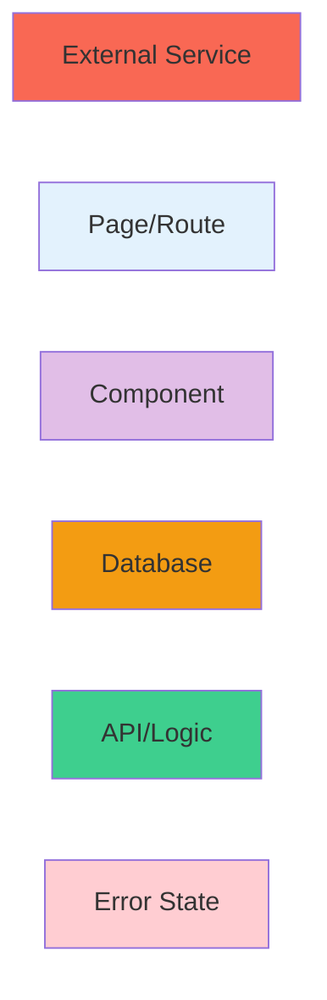

# DefCat DeckVault - Architecture Diagrams

This directory contains comprehensive visual documentation of the DefCat DeckVault system architecture, generated on 2025-10-28.

## Quick Navigation

| Diagram | Description | Best For |
|---------|-------------|----------|
| [System Architecture](#system-architecture) | Complete system overview with all layers | Understanding the big picture |
| [Database Schema](#database-schema) | ERD with all tables and relationships | Database design and queries |
| [Component Hierarchy](#component-hierarchy) | React component organization | Frontend development |
| [Data Flows](#data-flows) | Sequence diagrams for key user journeys | Understanding features |

---

## System Architecture

**File**: [system-architecture.md](./system-architecture.md)

**Contains**:
- 📐 **Multi-layer architecture diagram** showing:
  - Presentation Layer (Next.js pages)
  - API Layer (REST endpoints)
  - Business Logic Layer (lib/)
  - Component Layer (UI components)
  - Data Layer (Supabase + Storage)
  - External Services (Patreon, Moxfield, Scryfall)

- 🔄 **Key workflow sequences**:
  - Authentication flow (Patreon OAuth)
  - Deck submission process
  - Moxfield deck import

- 🏗️ **Architecture decisions**:
  - Why three-tier Supabase client pattern
  - Why custom Patreon OAuth
  - Why TanStack Query
  - Why Biome over ESLint

**Use this diagram when**:
- Onboarding new developers
- Planning new features
- Troubleshooting integration issues
- Presenting system design

---

## Database Schema

**File**: [database-schema.md](./database-schema.md)

**Contains**:
- 🗄️ **Complete ERD** with:
  - All 7 tables (profiles, decks, cards, etc.)
  - Foreign key relationships
  - Indexes and constraints
  - RLS policies

- 📊 **Table documentation**:
  - Purpose and key fields
  - Index strategy
  - RLS policy details

- 🔍 **Common query patterns**:
  - Get deck with cards (JOIN example)
  - Check submission limits
  - Filter by color identity

- 🛡️ **Data integrity rules**:
  - Foreign key cascades
  - Unique constraints
  - Check constraints

**Use this diagram when**:
- Writing database queries
- Planning schema migrations
- Optimizing query performance
- Understanding data relationships

---

## Component Hierarchy

**File**: [component-hierarchy.md](./component-hierarchy.md)

**Contains**:
- 🧩 **Component dependency graph** showing:
  - Page components (app/)
  - Feature components (auth, decks, admin)
  - Base UI components (shadcn/ui)
  - Magic UI components (MTG-specific)
  - Providers and contexts

- 📦 **Component categories**:
  - Layout components (Navbar, Footer, Sidebar)
  - Page components (route-level)
  - Feature components (domain-specific)
  - Base UI components (reusable primitives)

- 🎨 **Component patterns**:
  - Server vs Client components
  - Props drilling vs Context
  - Styling approach (Tailwind + CSS variables)

- ⚡ **Performance optimizations**:
  - Code splitting with dynamic imports
  - React.memo usage
  - Image optimization
  - Virtual scrolling (planned)

**Use this diagram when**:
- Building new features
- Refactoring components
- Understanding component dependencies
- Planning component library

---

## Data Flows

**File**: [data-flows.md](./data-flows.md)

**Contains**:
- 🔄 **5 key user journey sequences**:
  1. **User Authentication** - Patreon OAuth flow
  2. **Deck Submission** - User submits deck request
  3. **Deck Import** - Admin imports from Moxfield
  4. **Deck Browsing** - User filters and views decks
  5. **Admin User Management** - Role updates

- 🔐 **Three-tier access patterns**:
  - Browser Client (anonymous, read-only)
  - Server Client (authenticated, RLS)
  - Admin Client (privileged, bypass RLS)

- 💾 **Caching strategy**:
  - TanStack Query cache layers
  - 5-minute stale time
  - 10-minute garbage collection
  - Cache invalidation patterns

- ⚠️ **Error handling flows**:
  - Success paths
  - Client errors (400s)
  - Server errors (500s)
  - Network failures

**Use this diagram when**:
- Implementing new features
- Debugging user flows
- Understanding state management
- Optimizing API calls

---

## Diagram Conventions

### Color Coding



### Component Types

- **Server Components**: Light blue background
- **Client Components**: Purple background
- **Admin-only**: Red/orange tones
- **Public Access**: Green tones

### Data Flow Arrows

- **Solid lines** → Direct dependencies
- **Dashed lines** → Optional/conditional
- **Thick arrows** → Primary data flow
- **Thin arrows** → Secondary/helper data

---

## How to Update These Diagrams

### 1. Edit Mermaid Syntax
All diagrams use Mermaid.js syntax. Edit directly in the markdown files.

**Resources**:
- [Mermaid Documentation](https://mermaid.js.org/)
- [Mermaid Live Editor](https://mermaid.live/)

### 2. Regenerate with /visualize
```bash
/visualize src/ --output docs/diagrams/
```

### 3. Manual Updates
When making significant architecture changes:
1. Update the relevant diagram file
2. Validate syntax in Mermaid Live Editor
3. Commit changes with descriptive message
4. Update this README if adding new diagrams

---

## Rendering These Diagrams

### GitHub/GitLab
Mermaid diagrams render automatically in markdown preview.

### VS Code
Install extension: "Markdown Preview Mermaid Support"

### Obsidian
Mermaid is natively supported.

### Export Options

**PNG/SVG**:
- Use [Mermaid Live Editor](https://mermaid.live/)
- Paste diagram code
- Click "Actions" → "Download PNG/SVG"

**PDF**:
- Open markdown in browser (GitHub)
- Print to PDF

---

## Related Documentation

| Document | Location | Purpose |
|----------|----------|---------|
| Project README | [/files/COMPLETE_README.md](../../files/COMPLETE_README.md) | Full project overview |
| Quick Start | [/files/QUICK_START.md](../../files/QUICK_START.md) | 5-minute setup |
| Backend Setup | [/files/BACKEND_SETUP.md](../../files/BACKEND_SETUP.md) | Supabase/Resend config |
| API Testing | [/files/API_TESTING_GUIDE.md](../../files/API_TESTING_GUIDE.md) | API reference |
| Patreon Integration | [/files/PATREON_INTEGRATION.md](../../files/PATREON_INTEGRATION.md) | OAuth details |

---

## Contribution Guidelines

When modifying architecture:

1. **Update diagrams first** - Treat diagrams as architecture documentation
2. **Keep diagrams in sync** - If you change code, update diagrams
3. **Use consistent naming** - Match diagram labels to actual file/function names
4. **Add examples** - Include code snippets where helpful
5. **Link to source** - Reference actual file paths (e.g., `src/app/page.tsx:42`)

---

## Version History

| Date | Author | Changes |
|------|--------|---------|
| 2025-10-28 | Claude Code | Initial diagram generation |

---

## Questions?

For architecture questions or diagram suggestions:
1. Check the relevant diagram in this directory
2. Review the linked documentation files
3. Search codebase for implementation examples
4. Open an issue with specific questions

**Tip**: Use these diagrams during code reviews to ensure changes align with the intended architecture!
