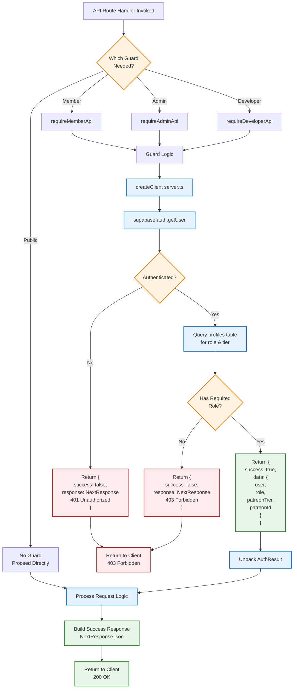
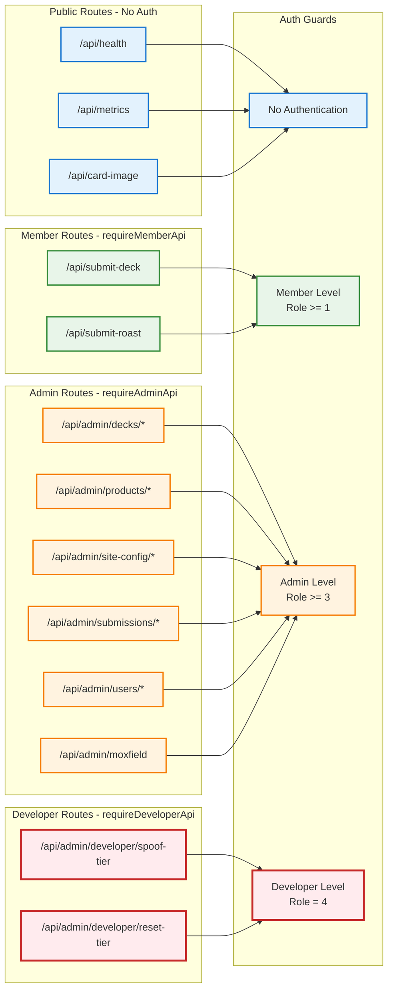
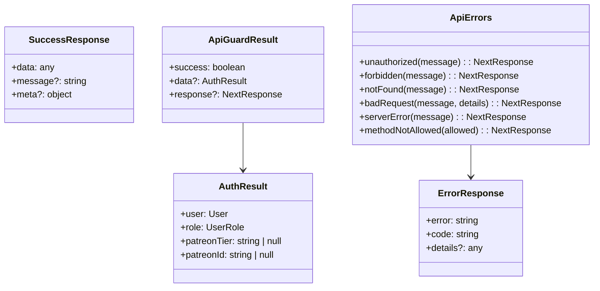

# API Routes & Middleware Architecture

This document shows the complete API route structure and middleware flow in DefCat's DeckVault.

**Last Updated:** 2025-11-15

## API Routes Structure

```mermaid
graph TB
    subgraph "Public API Routes"
        Health[/api/health<br/>GET - Health Check]
        Metrics[/api/metrics<br/>GET - App Metrics]
        CardImage[/api/card-image<br/>GET - Card Image Proxy]
        SubmitDeck[/api/submit-deck<br/>POST - Submit Deck]
        SubmitRoast[/api/submit-roast<br/>POST - Submit Roast]
    end

    subgraph "Auth API Routes"
        PatreonAuth[/api/auth/patreon<br/>GET/POST - OAuth Init]
        PatreonCallback[/api/auth/patreon-callback<br/>GET - OAuth Callback]
        CallbackSuccess[/api/auth/callback-success<br/>GET - Session Setup]
        Login[/api/auth/login<br/>GET - Login Page]
        Verify[/api/auth/verify<br/>GET - Email Verify]
        ResetPassword[/api/auth/reset-password<br/>GET - Password Reset]
    end

    subgraph "Admin API Routes - requireAdminApi"
        AdminDecks["/api/admin/decks<br/>GET/POST - Deck Management"]
        AdminDeckDetail["/api/admin/decks/:id<br/>GET/PATCH/DELETE - Deck Detail"]
        AdminImport["/api/admin/decks/import<br/>POST - Import Decks"]
        AdminMoxfield["/api/admin/moxfield<br/>POST - Sync Moxfield"]
        AdminProducts["/api/admin/products<br/>GET/POST - Products"]
        AdminProductDetail["/api/admin/products/:id<br/>PATCH/DELETE - Product Detail"]
        AdminSiteConfig["/api/admin/site-config<br/>GET - Site Config"]
        AdminSiteConfigAdd["/api/admin/site-config/add<br/>POST - Add Config"]
        AdminSiteConfigKey["/api/admin/site-config/:key<br/>PATCH/DELETE - Config Detail"]
        AdminSubmissions["/api/admin/submissions/:id<br/>PATCH/DELETE - Submissions"]
        AdminUsers["/api/admin/users/add<br/>POST - Add User"]
        AdminUserRole["/api/admin/users/update-role<br/>POST - Update Role"]
    end

    subgraph "Developer API Routes - requireDeveloperApi"
        DevSpoofTier[/api/admin/developer/spoof-tier<br/>POST - Spoof Tier (Dev)]
        DevResetTier[/api/admin/developer/reset-tier<br/>POST - Reset Tier (Dev)]
    end

    %% Public route flows
    Health --> NoAuth[No Auth Required]
    Metrics --> NoAuth
    CardImage --> ProxyToScryfall[Proxy to Scryfall API]
    SubmitDeck --> RequireMember[requireMemberApi]
    SubmitRoast --> RequireMember

    %% Auth route flows
    PatreonAuth --> InitOAuth[Redirect to Patreon]
    PatreonCallback --> ProcessOAuth[Process OAuth Callback]
    CallbackSuccess --> SetupSession[Setup Browser Session]

    %% Admin route flows
    AdminDecks --> RequireAdmin[requireAdminApi]
    AdminDeckDetail --> RequireAdmin
    AdminImport --> RequireAdmin
    AdminMoxfield --> RequireAdmin
    AdminProducts --> RequireAdmin
    AdminProductDetail --> RequireAdmin
    AdminSiteConfig --> RequireAdmin
    AdminSiteConfigAdd --> RequireAdmin
    AdminSiteConfigKey --> RequireAdmin
    AdminSubmissions --> RequireAdmin
    AdminUsers --> RequireAdmin
    AdminUserRole --> RequireAdmin

    %% Developer route flows
    DevSpoofTier --> RequireDev[requireDeveloperApi]
    DevResetTier --> RequireDev

    %% Styling
    classDef public fill:#e3f2fd,stroke:#1976d2,stroke-width:2px
    classDef auth fill:#f3e5f5,stroke:#7b1fa2,stroke-width:2px
    classDef admin fill:#fff3e0,stroke:#f57c00,stroke-width:2px
    classDef developer fill:#ffebee,stroke:#c62828,stroke-width:3px
    classDef guard fill:#e8f5e9,stroke:#388e3c,stroke-width:2px

    class Health,Metrics,CardImage,SubmitDeck,SubmitRoast public
    class PatreonAuth,PatreonCallback,CallbackSuccess,Login,Verify,ResetPassword auth
    class AdminDecks,AdminDeckDetail,AdminImport,AdminMoxfield,AdminProducts,AdminProductDetail,AdminSiteConfig,AdminSiteConfigAdd,AdminSiteConfigKey,AdminSubmissions,AdminUsers,AdminUserRole admin
    class DevSpoofTier,DevResetTier developer
    class NoAuth,RequireMember,RequireAdmin,RequireDev guard
```

## Middleware Request Flow

```mermaid
sequenceDiagram
    participant Browser
    participant Proxy as proxy(request)<br/>src/proxy.ts
    participant Supabase as Supabase Auth
    participant RouteHandler as Route Handler
    participant Page as Page Component

    Browser->>+Proxy: HTTP Request<br/>(with cookies)

    Proxy->>Proxy: Generate request ID<br/>Check pathname against<br/>PROTECTED_ROUTES

    alt Public Route
        Proxy->>Proxy: isProtectedRoute() = false
        Proxy-->>Browser: NextResponse.next()<br/>with X-Request-ID header
    else Protected Route
        Proxy->>Proxy: createServerClient<br/>with cookie handlers

        Proxy->>Proxy: getAll cookies from request
        Proxy->>+Supabase: getUser()
        Supabase-->>-Proxy: User session

        Proxy->>Proxy: setAll updated cookies<br/>in response

        alt User NOT authenticated
            Proxy->>Proxy: Build redirect URL<br/>/auth/login?error=auth_required<br/>&redirect={pathname}
            Proxy-->>-Browser: 302 Redirect to Login<br/>with X-Request-ID header
        else User authenticated
            Proxy->>Proxy: Query profiles table<br/>for user role

            alt Route has minimumRole requirement
                Proxy->>Proxy: hasMinimumRole(userRole, minimumRole)<br/>using ROLE_HIERARCHY

                alt User lacks required role
                    Proxy->>Proxy: Build redirect URL<br/>/?error=unauthorized
                    Proxy-->>-Browser: 302 Redirect to Home<br/>with X-Request-ID header
                else User has required role
                    Proxy->>Page: Continue to protected page
                    Page->>Page: requireRole()<br/>Double-check in component
                    Page-->>Proxy: Render page
                    Proxy-->>-Browser: Page HTML<br/>with X-Request-ID header
                end
            else No role requirement (just auth)
                Proxy->>RouteHandler: Continue to route handler
                RouteHandler->>RouteHandler: Handle request
                RouteHandler-->>Proxy: Response
                Proxy-->>-Browser: Response with cookies<br/>and X-Request-ID header
            end
        end
    end

    Note over Proxy,Supabase: Critical: Cookie handling must be exact<br/>Session will break if cookies not returned properly<br/>Request ID logged for debugging
```

## API Auth Guard Pattern



## Route-to-Guard Mapping



## Common API Response Patterns



## Middleware Configuration

Located at: `src/proxy.ts`

### Key Responsibilities
1. **Session Refresh**: Ensures Supabase session cookies are kept fresh
2. **Route Protection**: Role-based access control for protected routes
3. **Cookie Management**: Critical - must preserve all Supabase cookies exactly
4. **Request ID Generation**: Adds unique request ID to all responses for debugging

### Protected Routes Configuration
```typescript
const PROTECTED_ROUTES: Array<{
  path: string
  minimumRole: UserRole
  exactMatch?: boolean
}> = [
  { path: '/admin', minimumRole: 'moderator' },
  { path: '/dashboard', minimumRole: 'member' },
  { path: '/profile', minimumRole: 'member' },
  { path: '/submit', minimumRole: 'member' },
]

const PUBLIC_ROUTES = [
  '/',
  '/auth/login',
  '/auth/patreon-callback',
  '/auth/signup',
  '/about',
  '/pricing',
  '/decks',
  '/commanders',
  '/api/webhooks',
]
```

### Role Hierarchy Validation
```typescript
function hasMinimumRole(userRole: UserRole, minimumRole: UserRole): boolean {
  return ROLE_HIERARCHY[userRole] >= ROLE_HIERARCHY[minimumRole]
}

// ROLE_HIERARCHY from types/core.ts:
// { user: 0, member: 1, moderator: 2, admin: 3, developer: 4 }
```

### Critical Code Pattern
```typescript
export async function proxy(request: NextRequest) {
  const { pathname } = request.nextUrl
  const requestId = generateRequestId()

  const routeCheck = isProtectedRoute(pathname)
  if (!routeCheck.protected) {
    const response = NextResponse.next()
    response.headers.set('X-Request-ID', requestId)
    return response
  }

  let response = NextResponse.next({ request: { headers: request.headers } })

  const supabase = createServerClient(URL, KEY, {
    cookies: {
      getAll() { return request.cookies.getAll() },
      setAll(cookiesToSet) {
        // Set on both request and response
        cookiesToSet.forEach(({ name, value }) =>
          request.cookies.set(name, value)
        )
        response = NextResponse.next({ request })
        cookiesToSet.forEach(({ name, value, options }) =>
          response.cookies.set(name, value, options)
        )
      },
    },
  })

  const { data: { user } } = await supabase.auth.getUser()

  if (!user) {
    // Redirect to login
    const loginUrl = new URL('/auth/login', request.url)
    loginUrl.searchParams.set('error', 'auth_required')
    loginUrl.searchParams.set('redirect', pathname)
    const redirectResponse = NextResponse.redirect(loginUrl)
    redirectResponse.headers.set('X-Request-ID', requestId)
    return redirectResponse
  }

  if (routeCheck.minimumRole) {
    const { data: profile } = await supabase
      .from('profiles')
      .select('role')
      .eq('id', user.id)
      .single()

    const userRole = (profile?.role as UserRole) || 'user'

    if (!hasMinimumRole(userRole, routeCheck.minimumRole)) {
      // Redirect to home with error
      const homeUrl = new URL('/', request.url)
      homeUrl.searchParams.set('error', 'unauthorized')
      const redirectResponse = NextResponse.redirect(homeUrl)
      redirectResponse.headers.set('X-Request-ID', requestId)
      return redirectResponse
    }
  }

  response.headers.set('X-Request-ID', requestId)
  return response
}
```

## API Error Code Reference

| Code | Status | Description | Usage |
|------|--------|-------------|-------|
| `AUTH_REQUIRED` | 401 | User not authenticated | Any protected route without valid session |
| `FORBIDDEN` | 403 | Insufficient permissions | User lacks required role |
| `NOT_FOUND` | 404 | Resource not found | Invalid ID or missing data |
| `BAD_REQUEST` | 400 | Invalid request data | Validation errors, missing fields |
| `SERVER_ERROR` | 500 | Internal error | Unexpected failures |
| `METHOD_NOT_ALLOWED` | 405 | Invalid HTTP method | Using wrong method on endpoint |

## Best Practices

1. **Always use API guards in route handlers** - Never rely on middleware alone
2. **Check guard result before processing** - Return error response if `!success`
3. **Use ApiErrors helpers** - Consistent error responses
4. **Validate input data** - Check request body, params, query strings
5. **Return proper status codes** - Match HTTP semantics
6. **Include useful error details** - Help frontend handle errors
7. **Log errors server-side** - Debug production issues
8. **Never expose sensitive data** - Filter response data by user role
