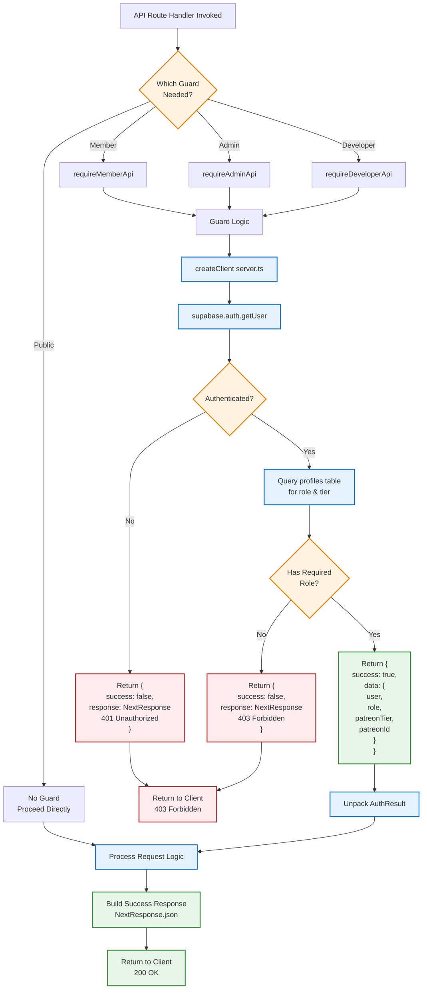
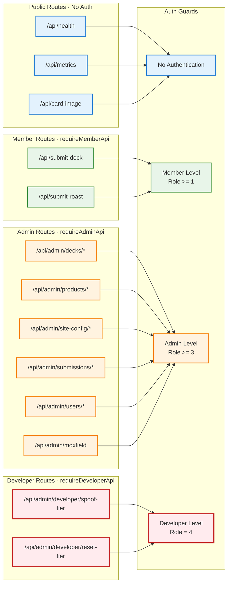
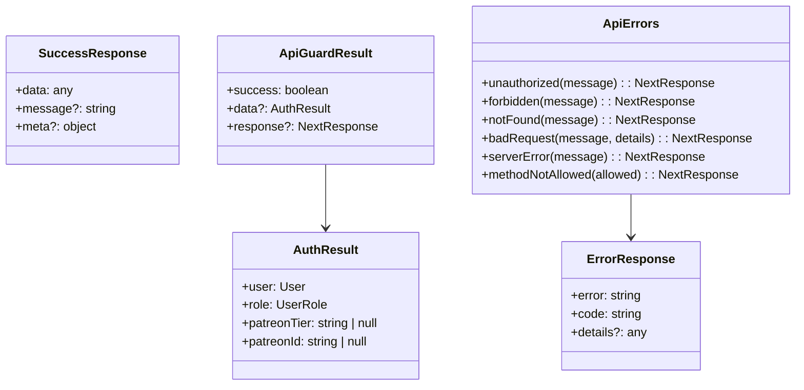

# API Routes & Middleware Architecture

This document shows the complete API route structure and middleware flow in DefCat's DeckVault.

## API Routes Structure

```mermaid
graph TB
    subgraph "Public API Routes"
        Health[/api/health<br/>GET - Health Check]
        Metrics[/api/metrics<br/>GET - App Metrics]
        CardImage[/api/card-image<br/>GET - Card Image Proxy]
        SubmitDeck[/api/submit-deck<br/>POST - Submit Deck]
        SubmitRoast[/api/submit-roast<br/>POST - Submit Roast]
    end

    subgraph "Auth API Routes"
        PatreonAuth[/api/auth/patreon<br/>GET/POST - OAuth Init]
        PatreonCallback[/api/auth/patreon-callback<br/>GET - OAuth Callback]
        CallbackSuccess[/api/auth/callback-success<br/>GET - Session Setup]
        Login[/api/auth/login<br/>GET - Login Page]
        Verify[/api/auth/verify<br/>GET - Email Verify]
        ResetPassword[/api/auth/reset-password<br/>GET - Password Reset]
    end

    subgraph "Admin API Routes - requireAdminApi"
        AdminDecks["/api/admin/decks<br/>GET/POST - Deck Management"]
        AdminDeckDetail["/api/admin/decks/:id<br/>GET/PATCH/DELETE - Deck Detail"]
        AdminImport["/api/admin/decks/import<br/>POST - Import Decks"]
        AdminMoxfield["/api/admin/moxfield<br/>POST - Sync Moxfield"]
        AdminProducts["/api/admin/products<br/>GET/POST - Products"]
        AdminProductDetail["/api/admin/products/:id<br/>PATCH/DELETE - Product Detail"]
        AdminSiteConfig["/api/admin/site-config<br/>GET - Site Config"]
        AdminSiteConfigAdd["/api/admin/site-config/add<br/>POST - Add Config"]
        AdminSiteConfigKey["/api/admin/site-config/:key<br/>PATCH/DELETE - Config Detail"]
        AdminSubmissions["/api/admin/submissions/:id<br/>PATCH/DELETE - Submissions"]
        AdminUsers["/api/admin/users/add<br/>POST - Add User"]
        AdminUserRole["/api/admin/users/update-role<br/>POST - Update Role"]
    end

    subgraph "Developer API Routes - requireDeveloperApi"
        DevSpoofTier[/api/admin/developer/spoof-tier<br/>POST - Spoof Tier (Dev)]
        DevResetTier[/api/admin/developer/reset-tier<br/>POST - Reset Tier (Dev)]
    end

    %% Public route flows
    Health --> NoAuth[No Auth Required]
    Metrics --> NoAuth
    CardImage --> ProxyToScryfall[Proxy to Scryfall API]
    SubmitDeck --> RequireMember[requireMemberApi]
    SubmitRoast --> RequireMember

    %% Auth route flows
    PatreonAuth --> InitOAuth[Redirect to Patreon]
    PatreonCallback --> ProcessOAuth[Process OAuth Callback]
    CallbackSuccess --> SetupSession[Setup Browser Session]

    %% Admin route flows
    AdminDecks --> RequireAdmin[requireAdminApi]
    AdminDeckDetail --> RequireAdmin
    AdminImport --> RequireAdmin
    AdminMoxfield --> RequireAdmin
    AdminProducts --> RequireAdmin
    AdminProductDetail --> RequireAdmin
    AdminSiteConfig --> RequireAdmin
    AdminSiteConfigAdd --> RequireAdmin
    AdminSiteConfigKey --> RequireAdmin
    AdminSubmissions --> RequireAdmin
    AdminUsers --> RequireAdmin
    AdminUserRole --> RequireAdmin

    %% Developer route flows
    DevSpoofTier --> RequireDev[requireDeveloperApi]
    DevResetTier --> RequireDev

    %% Styling
    classDef public fill:#e3f2fd,stroke:#1976d2,stroke-width:2px
    classDef auth fill:#f3e5f5,stroke:#7b1fa2,stroke-width:2px
    classDef admin fill:#fff3e0,stroke:#f57c00,stroke-width:2px
    classDef developer fill:#ffebee,stroke:#c62828,stroke-width:3px
    classDef guard fill:#e8f5e9,stroke:#388e3c,stroke-width:2px

    class Health,Metrics,CardImage,SubmitDeck,SubmitRoast public
    class PatreonAuth,PatreonCallback,CallbackSuccess,Login,Verify,ResetPassword auth
    class AdminDecks,AdminDeckDetail,AdminImport,AdminMoxfield,AdminProducts,AdminProductDetail,AdminSiteConfig,AdminSiteConfigAdd,AdminSiteConfigKey,AdminSubmissions,AdminUsers,AdminUserRole admin
    class DevSpoofTier,DevResetTier developer
    class NoAuth,RequireMember,RequireAdmin,RequireDev guard
```

## Middleware Request Flow

```mermaid
sequenceDiagram
    participant Browser
    participant NextMiddleware as Next.js Middleware
    participant SupabaseMiddleware as updateSession
    participant Supabase as Supabase Auth
    participant RouteHandler as Route Handler
    participant Page as Page Component

    Browser->>+NextMiddleware: HTTP Request<br/>(with cookies)

    NextMiddleware->>NextMiddleware: Check pathname

    alt Static Assets or _next routes
        NextMiddleware-->>Browser: Skip middleware<br/>Return immediately
    else API or Page Route
        NextMiddleware->>+SupabaseMiddleware: updateSession(request)

        SupabaseMiddleware->>SupabaseMiddleware: createServerClient<br/>with cookie handlers

        SupabaseMiddleware->>SupabaseMiddleware: getAll cookies from request
        SupabaseMiddleware->>+Supabase: getUser()
        Supabase-->>-SupabaseMiddleware: User session

        SupabaseMiddleware->>SupabaseMiddleware: setAll updated cookies<br/>in response

        alt Admin Route (/admin/*)
            SupabaseMiddleware->>SupabaseMiddleware: Check if user authenticated

            alt User NOT authenticated
                SupabaseMiddleware->>SupabaseMiddleware: Build redirect URL<br/>/auth/login?redirectTo={pathname}
                SupabaseMiddleware-->>-NextMiddleware: NextResponse.redirect
                NextMiddleware-->>-Browser: 302 Redirect to Login
            else User authenticated
                SupabaseMiddleware-->>-NextMiddleware: NextResponse with refreshed cookies
                NextMiddleware->>Page: Continue to admin page
                Page->>Page: requireAdmin()<br/>Check role
                alt User has admin role
                    Page-->>NextMiddleware: Render admin page
                    NextMiddleware-->>-Browser: Admin page HTML
                else User lacks admin role
                    Page-->>NextMiddleware: redirect('/?error=unauthorized')
                    NextMiddleware-->>-Browser: 302 Redirect to Home
                end
            end
        else Public or API Route
            SupabaseMiddleware-->>-NextMiddleware: NextResponse with refreshed cookies
            NextMiddleware->>RouteHandler: Continue to route handler
            RouteHandler->>RouteHandler: Handle auth in route<br/>(if needed)
            RouteHandler-->>NextMiddleware: Response
            NextMiddleware-->>-Browser: Response with fresh cookies
        end
    end

    Note over SupabaseMiddleware,Supabase: Critical: Cookie handling must be exact<br/>Session will break if cookies not returned properly
```

## API Auth Guard Pattern



## Route-to-Guard Mapping



## Common API Response Patterns



## Middleware Configuration

Located at: `src/lib/supabase/middleware.ts`

### Key Responsibilities
1. **Session Refresh**: Ensures Supabase session cookies are kept fresh
2. **Admin Route Protection**: Redirects unauthenticated users from /admin/*
3. **Cookie Management**: Critical - must preserve all Supabase cookies exactly

### Critical Code Pattern
```typescript
// MUST return supabaseResponse with cookies intact
export async function updateSession(request: NextRequest) {
  let supabaseResponse = NextResponse.next({ request })

  const supabase = createServerClient(URL, KEY, {
    cookies: {
      getAll() { return request.cookies.getAll() },
      setAll(cookiesToSet) {
        // Set on both request and response
        cookiesToSet.forEach(({ name, value }) =>
          request.cookies.set(name, value)
        )
        supabaseResponse = NextResponse.next({ request })
        cookiesToSet.forEach(({ name, value, options }) =>
          supabaseResponse.cookies.set(name, value, options)
        )
      },
    },
  })

  await supabase.auth.getUser() // Triggers session refresh

  // MUST return this exact response
  return supabaseResponse
}
```

## API Error Code Reference

| Code | Status | Description | Usage |
|------|--------|-------------|-------|
| `AUTH_REQUIRED` | 401 | User not authenticated | Any protected route without valid session |
| `FORBIDDEN` | 403 | Insufficient permissions | User lacks required role |
| `NOT_FOUND` | 404 | Resource not found | Invalid ID or missing data |
| `BAD_REQUEST` | 400 | Invalid request data | Validation errors, missing fields |
| `SERVER_ERROR` | 500 | Internal error | Unexpected failures |
| `METHOD_NOT_ALLOWED` | 405 | Invalid HTTP method | Using wrong method on endpoint |

## Best Practices

1. **Always use API guards in route handlers** - Never rely on middleware alone
2. **Check guard result before processing** - Return error response if `!success`
3. **Use ApiErrors helpers** - Consistent error responses
4. **Validate input data** - Check request body, params, query strings
5. **Return proper status codes** - Match HTTP semantics
6. **Include useful error details** - Help frontend handle errors
7. **Log errors server-side** - Debug production issues
8. **Never expose sensitive data** - Filter response data by user role
