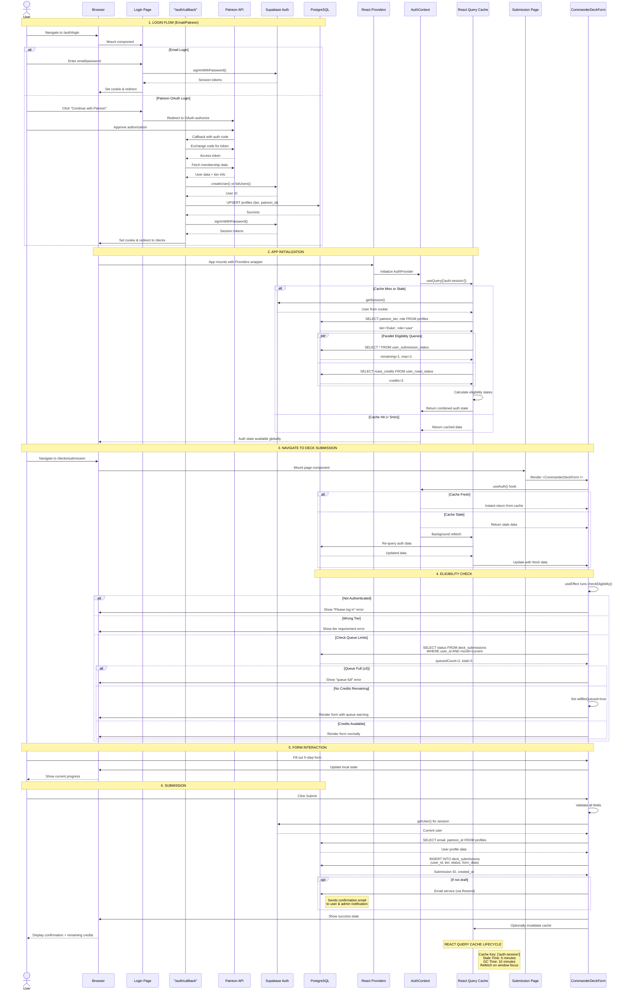

```mermaid
sequenceDiagram
      actor User
      participant Browser
      participant LoginPage as Login Page
      participant AuthRoute as "/auth/callback"
      participant PatreonAPI as Patreon API
      participant SupabaseAuth as Supabase Auth
      participant Database as PostgreSQL
      participant Providers as React Providers
      participant AuthContext as AuthContext
      participant ReactQuery as React Query Cache
      participant FormPage as Submission Page
      participant DeckForm as CommanderDeckForm

      %% LOGIN FLOW
      Note over User,Database: 1. LOGIN FLOW (Email/Patreon)
      User->>Browser: Navigate to /auth/login
      Browser->>LoginPage: Mount component

      alt Email Login
          User->>LoginPage: Enter email/password
          LoginPage->>SupabaseAuth: signInWithPassword()
          SupabaseAuth-->>LoginPage: Session tokens
          LoginPage->>Browser: Set cookie & redirect
      else Patreon OAuth Login
          User->>LoginPage: Click "Continue with Patreon"
          LoginPage->>PatreonAPI: Redirect to OAuth authorize
          User->>PatreonAPI: Approve authorization
          PatreonAPI->>AuthRoute: Callback with auth code
          AuthRoute->>PatreonAPI: Exchange code for token
          PatreonAPI-->>AuthRoute: Access token
          AuthRoute->>PatreonAPI: Fetch membership data
          PatreonAPI-->>AuthRoute: User data + tier info
          AuthRoute->>SupabaseAuth: createUser() or listUsers()
          SupabaseAuth-->>AuthRoute: User ID
          AuthRoute->>Database: UPSERT profiles (tier, patreon_id)
          Database-->>AuthRoute: Success
          AuthRoute->>SupabaseAuth: signInWithPassword()
          SupabaseAuth-->>AuthRoute: Session tokens
          AuthRoute->>Browser: Set cookie & redirect to /decks
      end

      %% APP INITIALIZATION
      Note over Browser,ReactQuery: 2. APP INITIALIZATION
      Browser->>Providers: App mounts with Providers wrapper
      Providers->>AuthContext: Initialize AuthProvider
      AuthContext->>ReactQuery: useQuery(['auth-session'])

      alt Cache Miss or Stale
          ReactQuery->>SupabaseAuth: getSession()
          SupabaseAuth-->>ReactQuery: User from cookie
          ReactQuery->>Database: SELECT patreon_tier, role FROM profiles
          Database-->>ReactQuery: tier='Duke', role='user'

          par Parallel Eligibility Queries
              ReactQuery->>Database: SELECT * FROM user_submission_status
              Database-->>ReactQuery: remaining=1, max=1
          and
              ReactQuery->>Database: SELECT roast_credits FROM user_roast_status
              Database-->>ReactQuery: credits=3
          end

          ReactQuery->>ReactQuery: Calculate eligibility states
          ReactQuery->>AuthContext: Return combined auth state
      else Cache Hit (< 5min)
          ReactQuery-->>AuthContext: Return cached data
      end

      AuthContext-->>Browser: Auth state available globally

      %% NAVIGATION TO SUBMISSION PAGE
      Note over User,DeckForm: 3. NAVIGATE TO DECK SUBMISSION
      User->>Browser: Navigate to /decks/submission
      Browser->>FormPage: Mount page component
      FormPage->>DeckForm: Render <CommanderDeckForm />
      DeckForm->>AuthContext: useAuth() hook

      alt Cache Fresh
          AuthContext-->>DeckForm: Instant return from cache
      else Cache Stale
          AuthContext-->>DeckForm: Return stale data
          AuthContext->>ReactQuery: Background refetch
          ReactQuery->>Database: Re-query auth data
          Database-->>ReactQuery: Updated data
          ReactQuery->>DeckForm: Update with fresh data
      end

      %% ELIGIBILITY CHECK
      Note over DeckForm,Database: 4. ELIGIBILITY CHECK
      DeckForm->>DeckForm: useEffect runs checkEligibility()

      alt Not Authenticated
          DeckForm->>Browser: Show "Please log in" error
      else Wrong Tier
          DeckForm->>Browser: Show tier requirement error
      else Check Queue Limits
          DeckForm->>Database: SELECT status FROM deck_submissions<br/>WHERE user_id AND month=current
          Database-->>DeckForm: queuedCount=2, total=3

          alt Queue Full (≥3)
              DeckForm->>Browser: Show "queue full" error
          else No Credits Remaining
              DeckForm->>DeckForm: Set willBeQueued=true
              DeckForm->>Browser: Render form with queue warning
          else Credits Available
              DeckForm->>Browser: Render form normally
          end
      end

      %% FORM INTERACTION
      Note over User,DeckForm: 5. FORM INTERACTION
      User->>DeckForm: Fill out 5-step form
      DeckForm->>Browser: Update local state
      Browser-->>User: Show current progress

      %% SUBMISSION
      Note over User,Database: 6. SUBMISSION
      User->>DeckForm: Click Submit
      DeckForm->>DeckForm: Validate all fields
      DeckForm->>SupabaseAuth: getUser() for session
      SupabaseAuth-->>DeckForm: Current user
      DeckForm->>Database: SELECT email, patreon_id FROM profiles
      Database-->>DeckForm: User profile data

      DeckForm->>Database: INSERT INTO deck_submissions<br/>(user_id, tier, status, form_data)
      Database-->>DeckForm: Submission ID, created_at

      opt If not draft
          DeckForm->>Database: Email service (via Resend)
          Note right of Database: Sends confirmation email<br/>to user & admin notification
      end

      DeckForm->>Browser: Show success state
      DeckForm->>ReactQuery: Optionally invalidate cache
      Browser-->>User: Display confirmation + remaining credits

      %% CACHE LIFECYCLE
      Note over ReactQuery: REACT QUERY CACHE LIFECYCLE
      Note right of ReactQuery: Cache Key: ['auth-session']<br/>Stale Time: 5 minutes<br/>GC Time: 10 minutes<br/>Refetch on window focus
```