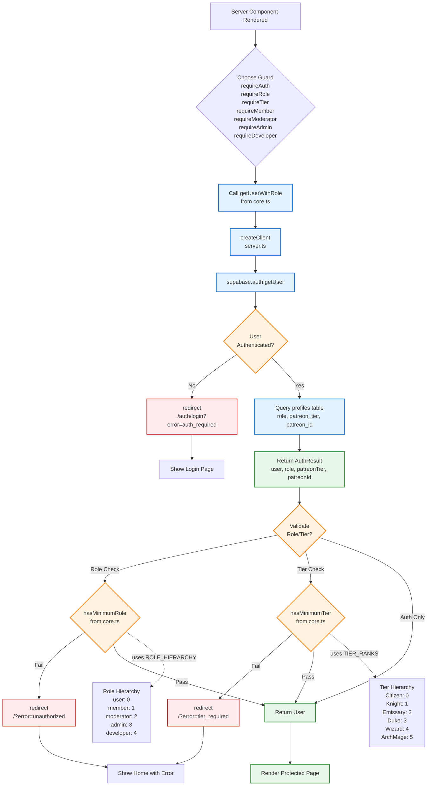
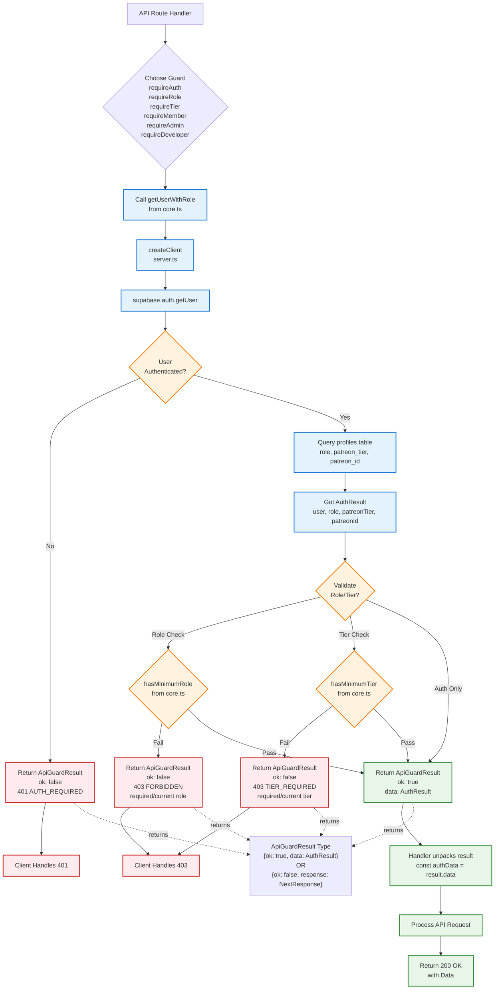

# Authentication & Authorization Architecture

This document contains diagrams showing the authentication and authorization flows in DefCat's DeckVault.

**Last Updated:** 2025-11-15

## 1. Three-Tier Supabase Client Architecture

```mermaid
graph TB
    subgraph "Client Context - Browser"
        ClientComp[Client Component<br/>'use client']
        ClientHooks[React Hooks<br/>useState, useEffect]
        BrowserClient[createBrowserClient<br/>@supabase/ssr]
    end

    subgraph "Server Context - RSC/Actions"
        ServerComp[Server Component<br/>async function]
        ServerActions[Server Actions<br/>async function]
        RouteHandlers[Route Handlers<br/>API Routes]
        ServerClient[createServerClient<br/>@supabase/ssr<br/>+ cookies]
    end

    subgraph "Admin Context - Privileged"
        AdminScripts[Background Scripts]
        AdminOps[Admin Operations]
        AdminClient[createAdminClient<br/>@supabase/supabase-js<br/>Service Role Key]
    end

    subgraph "Supabase Backend"
        SupabaseAuth[Supabase Auth]
        SupabaseDB[(PostgreSQL)]
        RLS[Row Level Security]
    end

    %% Client Flow
    ClientComp --> ClientHooks
    ClientHooks --> BrowserClient
    BrowserClient -->|Anon Key| SupabaseAuth
    BrowserClient -->|User Session| RLS
    RLS -->|Filtered by User| SupabaseDB

    %% Server Flow
    ServerComp --> ServerClient
    ServerActions --> ServerClient
    RouteHandlers --> ServerClient
    ServerClient -->|Anon Key + Cookies| SupabaseAuth
    ServerClient -->|User Session| RLS

    %% Admin Flow
    AdminScripts --> AdminClient
    AdminOps --> AdminClient
    AdminClient -->|Service Role Key| SupabaseAuth
    AdminClient -.Bypasses RLS.-> SupabaseDB

    %% Styling
    classDef client fill:#f3e5f5,stroke:#7b1fa2,stroke-width:2px
    classDef server fill:#e8f5e9,stroke:#388e3c,stroke-width:2px
    classDef admin fill:#ffebee,stroke:#c62828,stroke-width:2px
    classDef backend fill:#fff3e0,stroke:#f57c00,stroke-width:2px

    class ClientComp,ClientHooks,BrowserClient client
    class ServerComp,ServerActions,RouteHandlers,ServerClient server
    class AdminScripts,AdminOps,AdminClient admin
    class SupabaseAuth,SupabaseDB,RLS backend
```

## 2. Server Component Auth Guard Flow



## 3. API Route Auth Guard Flow



## 4. Role-Based Access Control Hierarchy


## 5. Middleware Session Refresh Flow


## Key Authentication Patterns

### Three-Module Architecture

The auth system is split into three modules:

1. **`core.ts`** - Shared core logic
   - `getUserWithRole()` - Fetches user with profile data
   - `hasMinimumRole()` - Role hierarchy validation
   - `hasMinimumTier()` - Tier hierarchy validation
   - Uses `ROLE_HIERARCHY` and `TIER_RANKS` from `types/core.ts`

2. **`server.ts`** - Server Component guards
   - `requireAuth()`, `requireRole()`, `requireTier()`
   - Convenience functions: `requireMember()`, `requireAdmin()`, etc.
   - **Redirects** on auth failure using Next.js `redirect()`
   - Non-redirecting helpers: `getCurrentUser()`, `hasRole()`, `hasTier()`

3. **`api.ts`** - API Route guards
   - Same function names as server.ts
   - **Returns `NextResponse`** instead of redirecting
   - Returns `ApiGuardResult` type: `{ok: true, data: AuthResult}` or `{ok: false, response: NextResponse}`
   - Includes `ApiErrors` helper object for standard error responses

### Server Component Pattern
```typescript
// src/app/admin/page.tsx
import { requireAdmin } from '@/lib/auth/server'

export default async function AdminPage() {
  const { user, role, patreonTier } = await requireAdmin()
  const supabase = await createClient()

  // Fetch data with RLS applied
  const { data } = await supabase.from('decks').select('*')

  return <AdminDashboard user={user} decks={data} />
}
```

### API Route Pattern
```typescript
// src/app/api/admin/users/route.ts
import { requireAdmin } from '@/lib/auth/api'

export async function GET(request: Request) {
  const result = await requireAdmin()
  if (!result.ok) return result.response

  const { user, role, patreonTier } = result.data

  // Process request with authenticated user
  return NextResponse.json({ data })
}
```

### Tier-Based Access Pattern
```typescript
// Require specific Patreon tier
import { requireTier, requireWizard } from '@/lib/auth/server'

export default async function PremiumPage() {
  // Either specific tier
  const { user, patreonTier } = await requireTier('Wizard')

  // Or convenience function
  const authData = await requireWizard()

  return <PremiumContent />
}
```

### Client Component Pattern
```typescript
// src/components/admin/Panel.tsx
'use client'

export function AdminPanel() {
  const { data, isLoading } = useQuery({
    queryKey: ['admin-data'],
    queryFn: async () => {
      const res = await fetch('/api/admin/data')
      if (!res.ok) throw new Error('Unauthorized')
      return res.json()
    }
  })

  return <div>...</div>
}
```

## Security Considerations

1. **Never mix client types**: Always use the correct Supabase client for the context
2. **API routes use API guards**: Returns responses instead of redirecting
3. **Middleware is critical**: Must return Supabase response with cookies intact
4. **RLS is the last line of defense**: Even with auth guards, RLS policies protect data
5. **Admin client bypasses RLS**: Use only in trusted server-side contexts
6. **Role hierarchy**: Higher roles automatically satisfy lower role requirements
