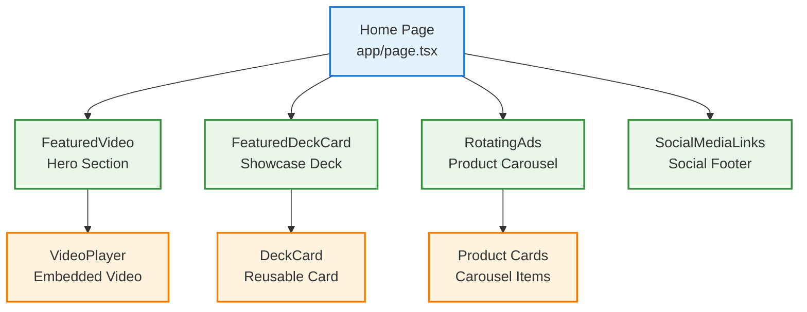
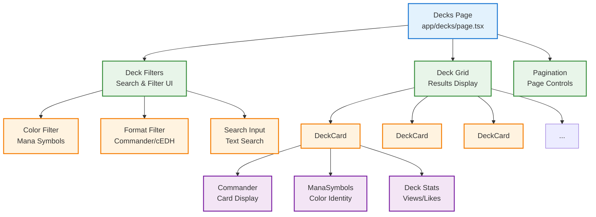
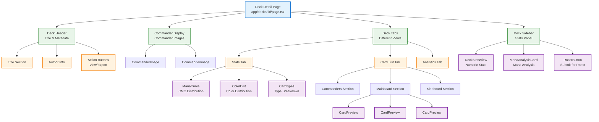
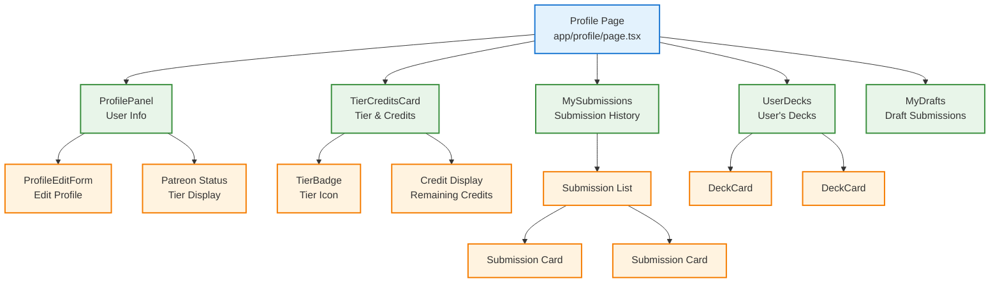
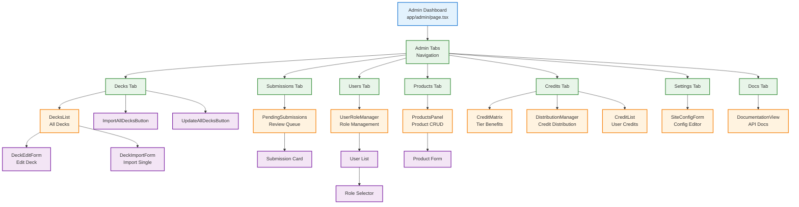
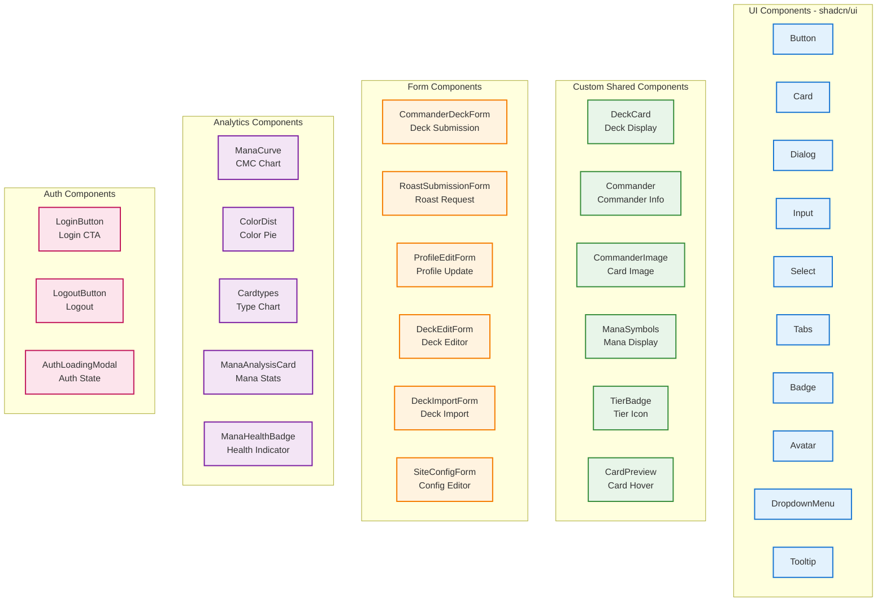

# Component Hierarchy & Structure

This document shows the React component hierarchy and organization in DefCat's DeckVault.

**Last Updated:** 2025-11-15

## App-Level Component Structure

```mermaid
graph TB
    RootLayout[RootLayout<br/>app/layout.tsx]

    RootLayout --> Providers[Providers<br/>Context Providers]
    RootLayout --> HeaderWrapper[HeaderWrapper<br/>Layout Header]
    RootLayout --> MainContent[Main Content Area<br/>children]
    RootLayout --> Footer[Footer<br/>Layout Footer]

    subgraph "Context Providers"
        Providers --> ThemeProvider[ThemeProvider<br/>Dark/Light Mode]
        Providers --> AuthProvider[AuthProvider<br/>User Session]
        Providers --> TanStackProvider[QueryClientProvider<br/>TanStack Query]
    end

    subgraph "Header Components"
        HeaderWrapper --> Header[Header<br/>Navigation Bar]
        Header --> NavigationHeader[NavigationHeader<br/>Main Nav]
        Header --> UserMenu[UserMenu<br/>User Dropdown]
        Header --> LoginButton[LoginButton]
        Header --> LogoutButton[LogoutButton]
    end

    subgraph "Main Content Routes"
        MainContent --> HomePage["/ - Home Page"]
        MainContent --> DecksPage["/decks - Deck Browser"]
        MainContent --> DeckDetailPage["/decks/:id - Deck Detail"]
        MainContent --> ProfilePage["/profile - User Profile"]
        MainContent --> AdminPage["/admin - Admin Dashboard"]
        MainContent --> AuthPages["/auth/* - Auth Pages"]
    end

    %% Styling
    classDef layout fill:#e3f2fd,stroke:#1976d2,stroke-width:2px
    classDef provider fill:#f3e5f5,stroke:#7b1fa2,stroke-width:2px
    classDef navigation fill:#e8f5e9,stroke:#388e3c,stroke-width:2px
    classDef page fill:#fff3e0,stroke:#f57c00,stroke-width:2px

    class RootLayout,HeaderWrapper,Header,Footer layout
    class Providers,ThemeProvider,AuthProvider,TanStackProvider provider
    class NavigationHeader,UserMenu,LoginButton,LogoutButton navigation
    class HomePage,DecksPage,DeckDetailPage,ProfilePage,AdminPage,AuthPages page
```



## Page-Specific Component Trees

### Home Page Components



### Deck Browser Components



### Deck Detail Page Components



### Profile Page Components



### Admin Dashboard Components



## Shared/Reusable Components



## Component Type Breakdown

### Server Components (RSC)
- Default in Next.js 16 App Router
- Can fetch data directly
- No client-side interactivity
- Examples: Page components, layout components

**Files:**
- `app/page.tsx`
- `app/decks/page.tsx`
- `app/decks/[id]/page.tsx`
- `app/profile/page.tsx`
- `app/admin/page.tsx`

### Client Components
- Marked with `'use client'` directive
- Can use hooks, state, events
- Required for interactivity
- Examples: Forms, interactive UI

**Files:**
- `components/auth/login-button.tsx`
- `components/forms/CommanderDeckForm.tsx`
- `components/profile/UserMenu.tsx`
- `components/decks/DeckCard.tsx` (with interactions)

### Hybrid Pattern
- Server Component wrapper
- Client Component for interactive parts
- Optimizes performance

**Example:**
```typescript
// Server Component (default)
export default async function DeckPage({ params }) {
  const deck = await fetchDeck(params.id) // Server-side fetch
  return <DeckClientView deck={deck} />
}

// Client Component
'use client'
function DeckClientView({ deck }) {
  // Interactive features
  const [showDetails, setShowDetails] = useState(false)
  return <div>...</div>
}
```

## Component File Organization

```
src/components/
├── ui/                     # shadcn/ui base components
│   ├── button.tsx
│   ├── card.tsx
│   ├── dialog.tsx
│   └── ...
├── layout/                 # Layout components
│   ├── Header.tsx
│   ├── HeaderWrapper.tsx
│   ├── Footer.tsx
│   └── Navigation.tsx
├── auth/                   # Authentication UI
│   ├── login-button.tsx
│   ├── logout-button.tsx
│   └── auth-loading-modal.tsx
├── decks/                  # Deck-related components
│   ├── DeckCard.tsx
│   ├── Commander.tsx
│   ├── CommanderImage.tsx
│   ├── ManaSymbols.tsx
│   ├── CardPreview.tsx
│   ├── ManaCurve.tsx
│   ├── ColorDist.tsx
│   ├── Cardtypes.tsx
│   └── details/
│       ├── DeckSidebar.tsx
│       ├── DeckStatsView.tsx
│       └── DeckEmptyState.tsx
├── profile/                # Profile components
│   ├── ProfilePanel.tsx
│   ├── ProfileEditForm.tsx
│   ├── TierCreditsCard.tsx
│   ├── UserMenu.tsx
│   ├── MySubmissions.tsx
│   ├── MyDrafts.tsx
│   └── UserDecks.tsx
├── admin/                  # Admin panel components
│   ├── DecksList.tsx
│   ├── ImportAllDecksButton.tsx
│   ├── UpdateAllDecksButton.tsx
│   ├── PendingSubmissions.tsx
│   ├── UserRoleManager.tsx
│   ├── ProductsPanel.tsx
│   ├── CreditMatrix.tsx
│   ├── DistributionManager.tsx
│   ├── CreditList.tsx
│   └── DocumentationView.tsx
├── forms/                  # Form components
│   ├── CommanderDeckForm.tsx
│   ├── RoastSubmissionForm.tsx
│   ├── DeckEditForm.tsx
│   ├── DeckImportForm.tsx
│   └── SiteConfigForm.tsx
├── tier/                   # Tier-related
│   └── TierBadge.tsx
├── home/                   # Home page specific
│   ├── FeaturedVideo.tsx
│   ├── FeaturedDeckCard.tsx
│   ├── RotatingAds.tsx
│   └── SocialMediaLinks.tsx
└── analytics/              # Analytics & charts
    └── mana/
        ├── ManaAnalysisCard.tsx
        └── ManaHealthBadge.tsx
```

## Key Patterns

1. **Server-First**: Default to server components, use client only when needed
2. **Composition**: Small, focused components that compose together
3. **Reusability**: Shared components in common directories
4. **Type Safety**: TypeScript types for all props
5. **Accessibility**: ARIA labels, keyboard navigation
6. **Responsive**: Mobile-first Tailwind CSS
7. **Performance**: Code splitting, lazy loading, memoization where needed
