# Data Flow & State Management

This document shows how data flows through DefCat's DeckVault using TanStack Query, Server Components, and Supabase.

## Overall Data Flow Architecture

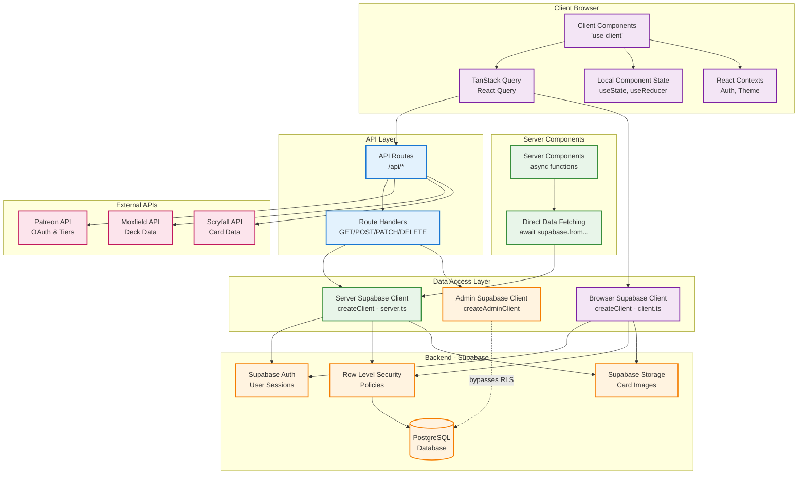

## TanStack Query Data Flow

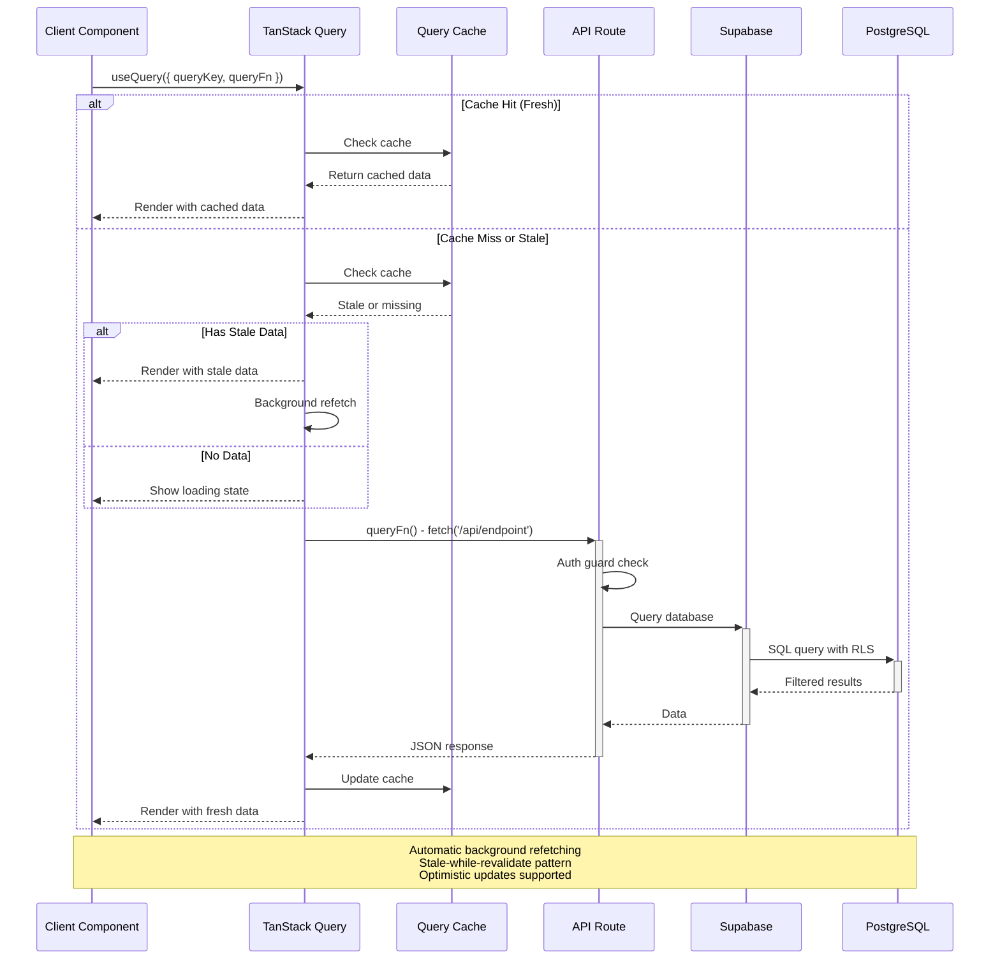

## Server Component Data Fetching

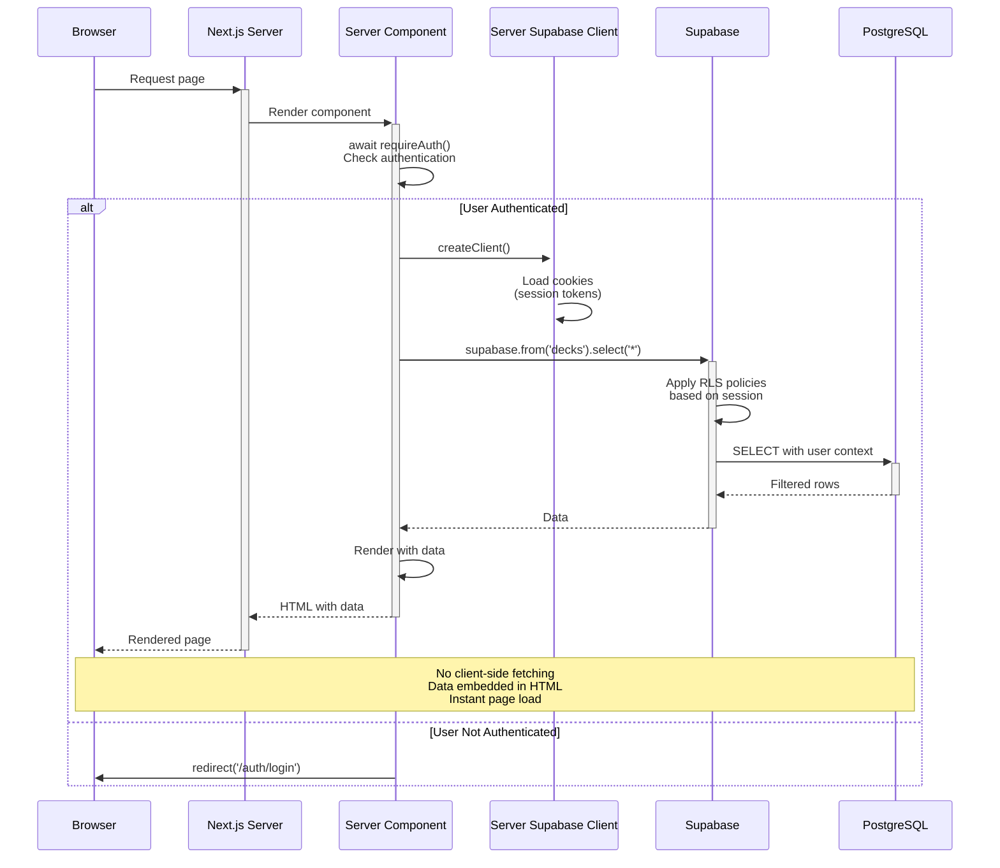

## Mutation Flow (TanStack Query)

```mermaid
sequenceDiagram
    participant User
    participant Component as Client Component
    participant Mutation as useMutation
    participant Optimistic as Optimistic Update
    participant Cache as Query Cache
    participant API as API Route
    participant DB as Database

    User->>Component: Submit form<br/>(e.g., submit deck)

    Component->>Mutation: mutate(data)

    alt Optimistic Update
        Mutation->>Optimistic: Apply optimistic update
        Optimistic->>Cache: Update cache immediately
        Cache-->>Component: Render with optimistic data
        Component-->>User: Show success state
    end

    Mutation->>+API: POST /api/submit-deck<br/>{deck data}

    API->>API: requireMemberApi()<br/>Check auth & credits

    alt Auth Success
        API->>+DB: INSERT deck_submission
        DB-->>-API: Success

        API-->>-Mutation: 200 OK

        Mutation->>Cache: Invalidate related queries<br/>queryClient.invalidateQueries(['submissions'])

        Cache->>API: Background refetch
        API->>DB: Fresh data
        DB-->>API: Updated data
        API-->>Cache: Fresh data
        Cache-->>Component: Update UI

        Component-->>User: Show final state
    else Auth Failed or Error
        API-->>-Mutation: 401/403/500 Error

        Mutation->>Optimistic: Rollback optimistic update
        Optimistic->>Cache: Restore previous state
        Cache-->>Component: Restore UI

        Component-->>User: Show error message
    end
```

## Query Invalidation & Refetching

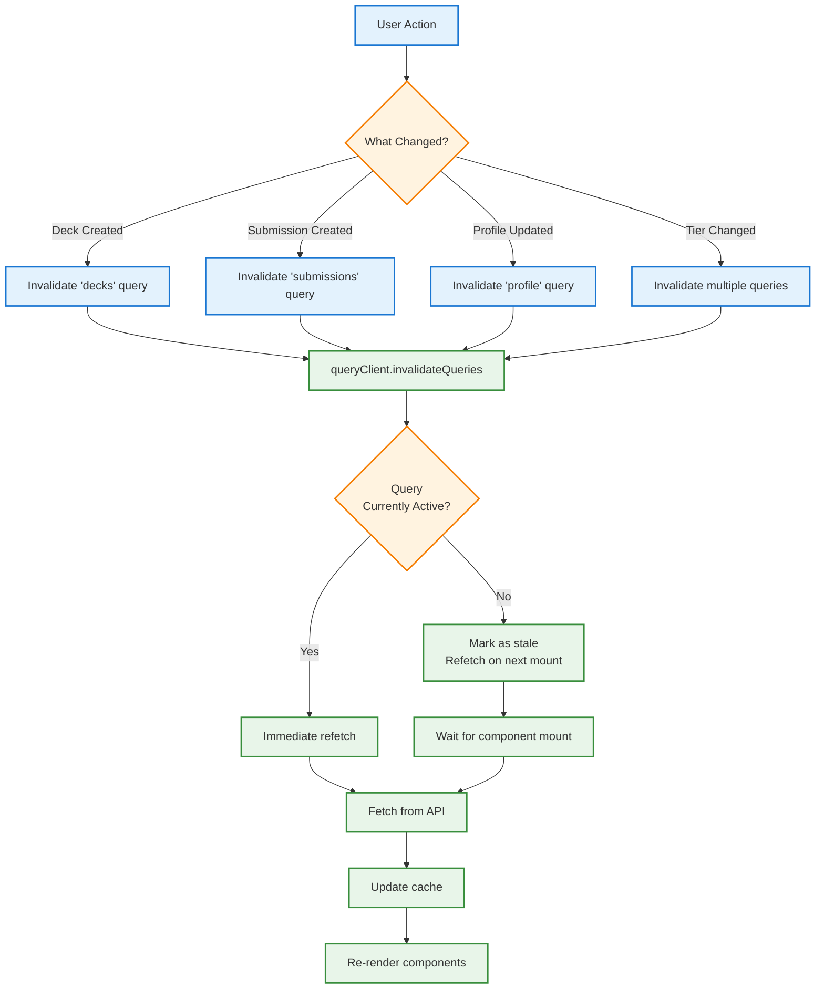

## Common Data Flow Patterns

### Pattern 1: Server Component + Direct Fetch

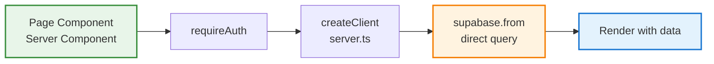

**Use When:**
- Initial page load
- Data doesn't need client-side reactivity
- SEO-critical content
- No real-time updates needed

### Pattern 2: Client Component + TanStack Query

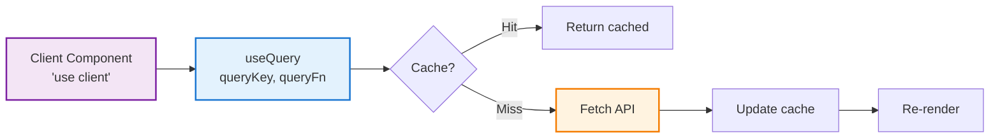

**Use When:**
- User interactions trigger data changes
- Real-time updates needed
- Optimistic updates required
- Client-side filtering/sorting

### Pattern 3: Hybrid - Server Initial + Client Updates

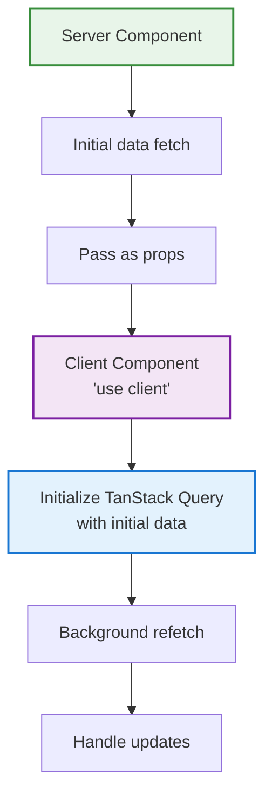

**Use When:**
- Best of both worlds
- Fast initial render (server)
- Interactive updates (client)
- Complex UIs

## Query Key Patterns

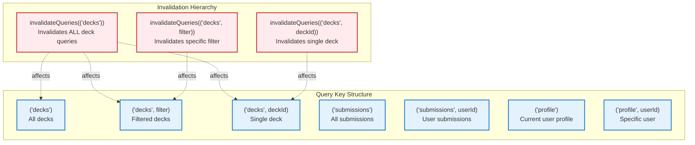

## State Management Layers

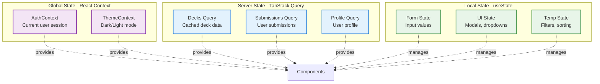

## Caching Strategy

### TanStack Query Cache Configuration

```typescript
const queryClient = new QueryClient({
  defaultOptions: {
    queries: {
      staleTime: 5 * 60 * 1000,        // 5 minutes
      cacheTime: 10 * 60 * 1000,       // 10 minutes
      refetchOnWindowFocus: true,       // Refetch on focus
      refetchOnReconnect: true,         // Refetch on reconnect
      retry: 1,                         // Retry once on failure
    },
  },
})
```

### Cache Behavior

| Data Type | Stale Time | Cache Time | Refetch on Focus |
|-----------|------------|------------|------------------|
| Decks List | 5 min | 10 min | Yes |
| Deck Detail | 5 min | 10 min | Yes |
| User Profile | 10 min | 30 min | Yes |
| Submissions | 2 min | 5 min | Yes |
| Site Config | 30 min | 60 min | No |

## Real-World Examples

### Example 1: Deck Submission Flow

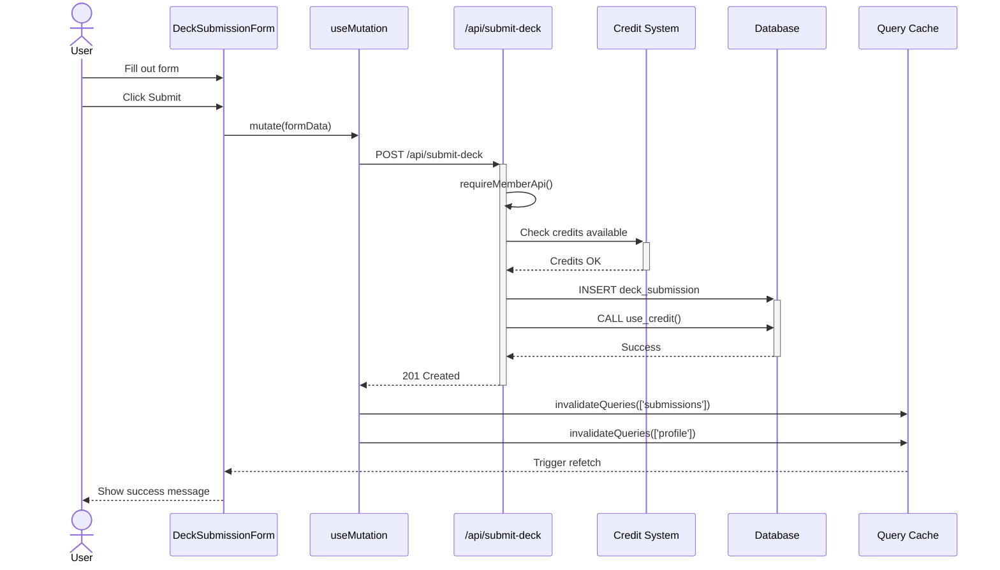

### Example 2: Admin Deck Import

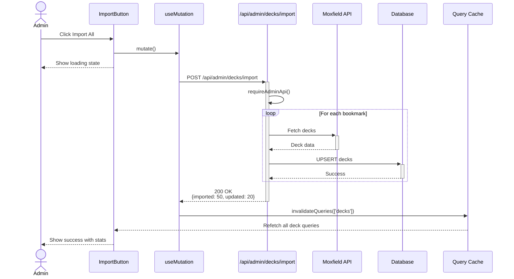

## Performance Optimizations

1. **Prefetching**: Hover over deck cards prefetches deck details
2. **Pagination**: Only load visible page, cache pages separately
3. **Infinite Query**: Scroll-based loading for long lists
4. **Parallel Queries**: Load multiple resources simultaneously
5. **Background Refetch**: Update stale data without blocking UI
6. **Optimistic Updates**: Instant UI feedback on mutations
7. **Query Deduplication**: Multiple components, single network request
