# DefCat DeckVault - Data Flow Diagrams

## Key User Journeys

### 1. User Authentication Flow

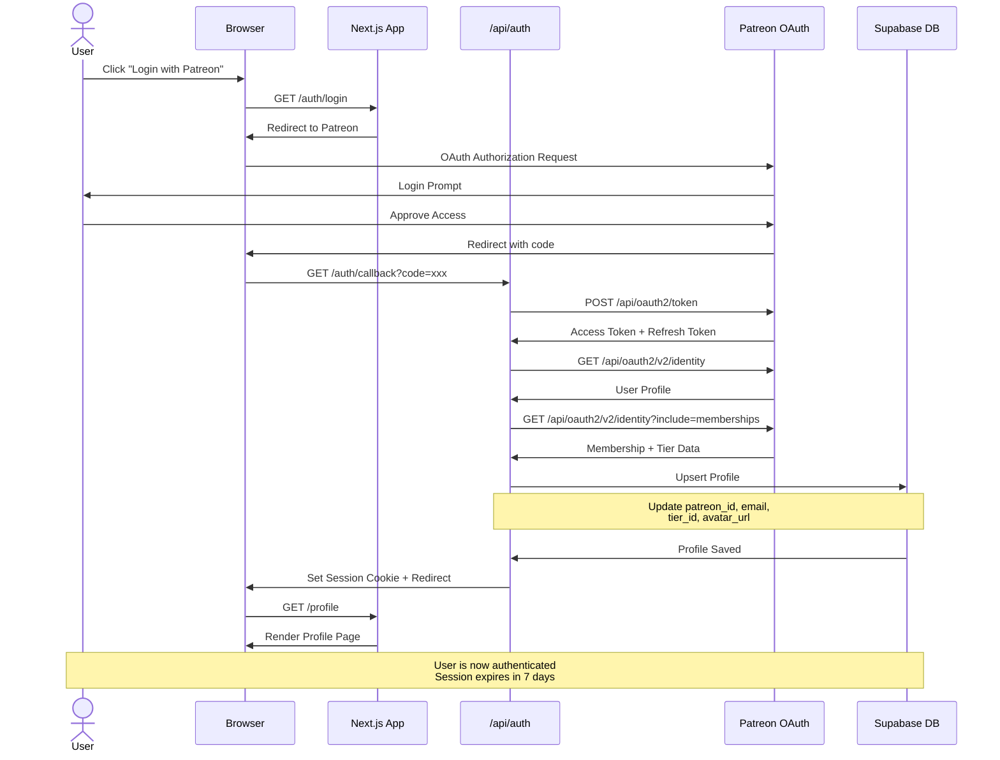

### 2. Deck Submission Flow

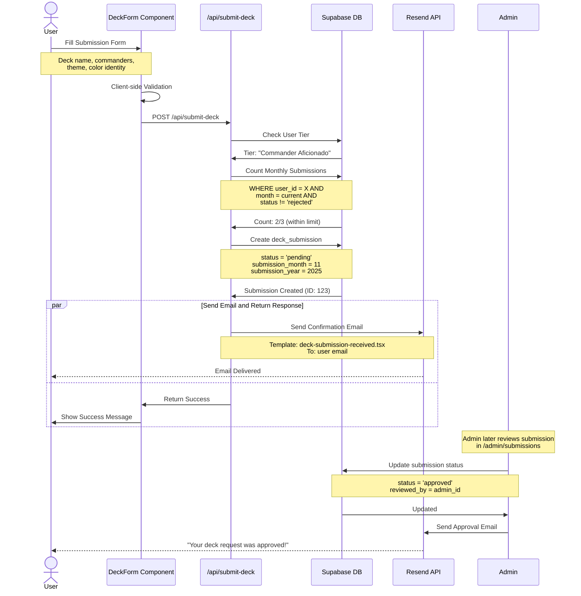

### 3. Deck Import from Moxfield (Admin)

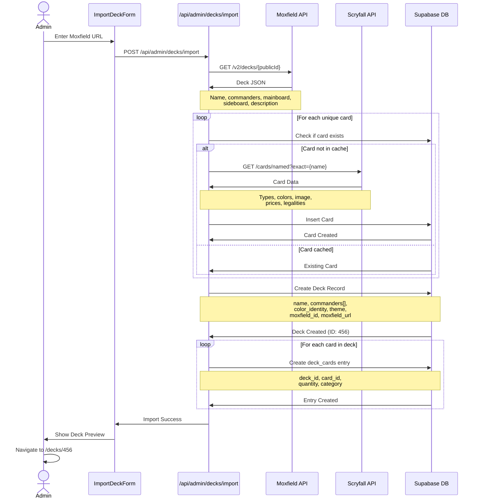

### 4. Deck Browsing Flow

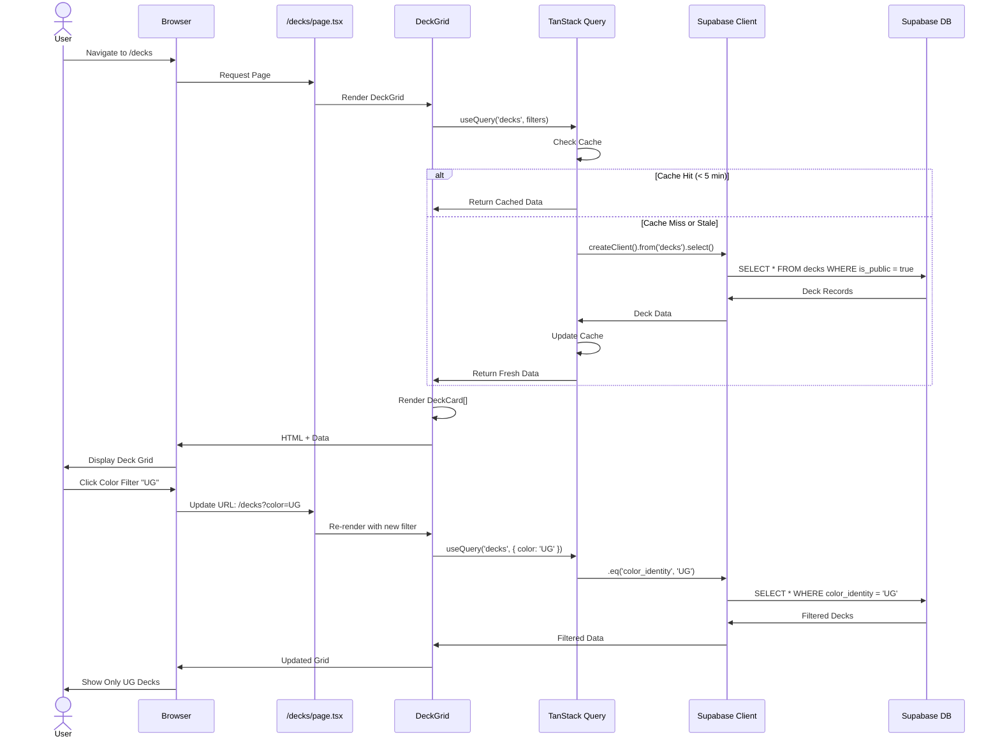

### 5. Admin User Management Flow

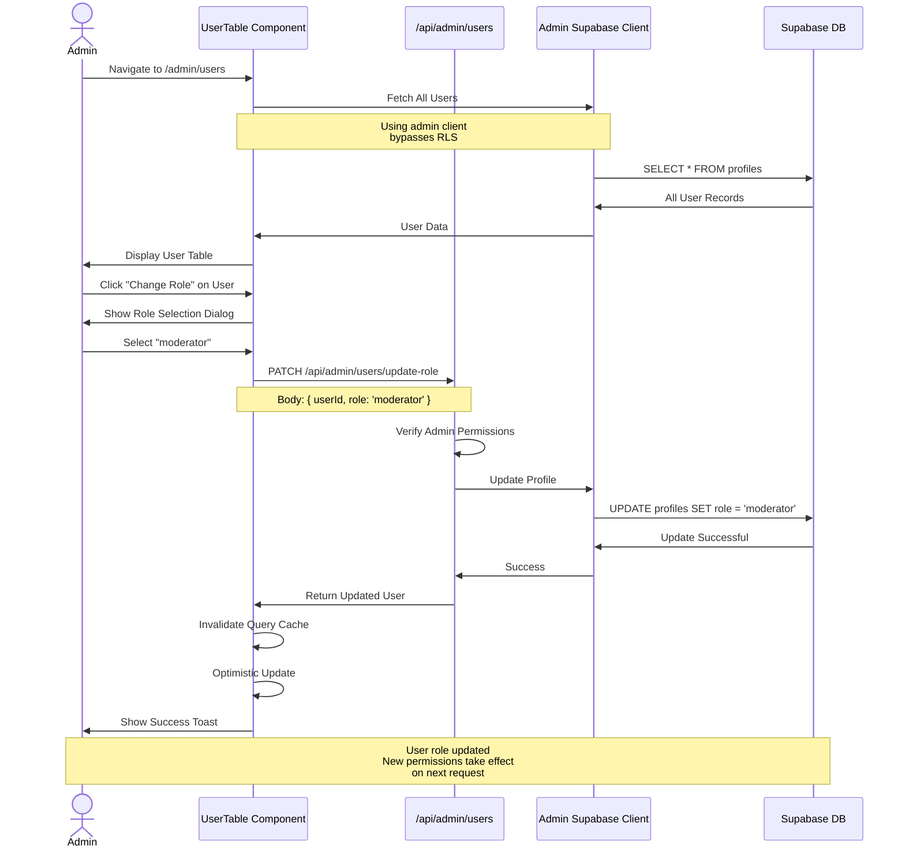

## Data Access Patterns

### Browser Client (Anonymous)

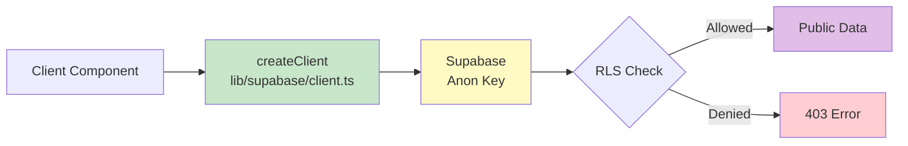

**Use Cases**:
- Public deck browsing
- Card image loading
- Unauthenticated reads

### Server Client (Authenticated)

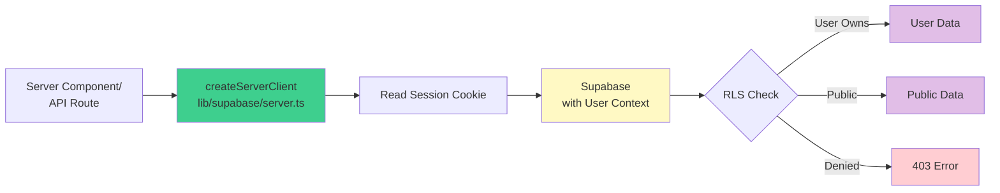

**Use Cases**:
- User profile updates
- Deck submissions
- User-specific queries

### Admin Client (Privileged)

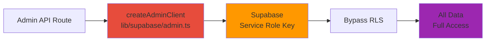

**Use Cases**:
- User role management
- Bulk data operations
- System administration

## Caching Strategy

### TanStack Query Cache Layers

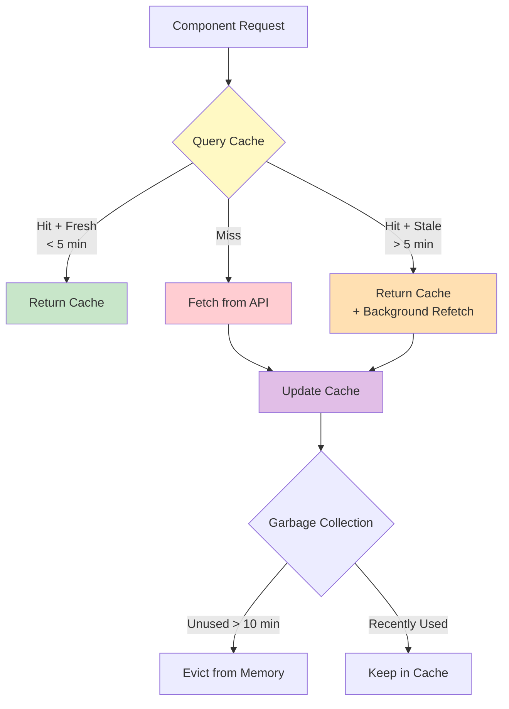

**Configuration** (`src/app/layout.tsx`):
```typescript
const queryClient = new QueryClient({
  defaultOptions: {
    queries: {
      staleTime: 5 * 60 * 1000,  // 5 minutes
      gcTime: 10 * 60 * 1000,     // 10 minutes
      refetchOnWindowFocus: true,
      retry: 1
    }
  }
})
```

### Cache Invalidation Patterns

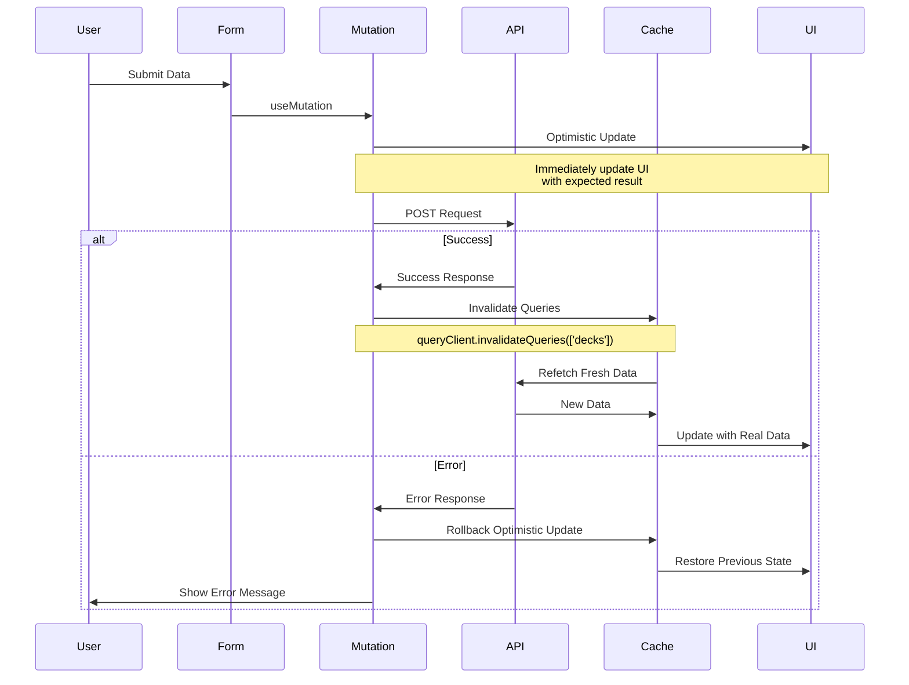

## Error Handling Flow

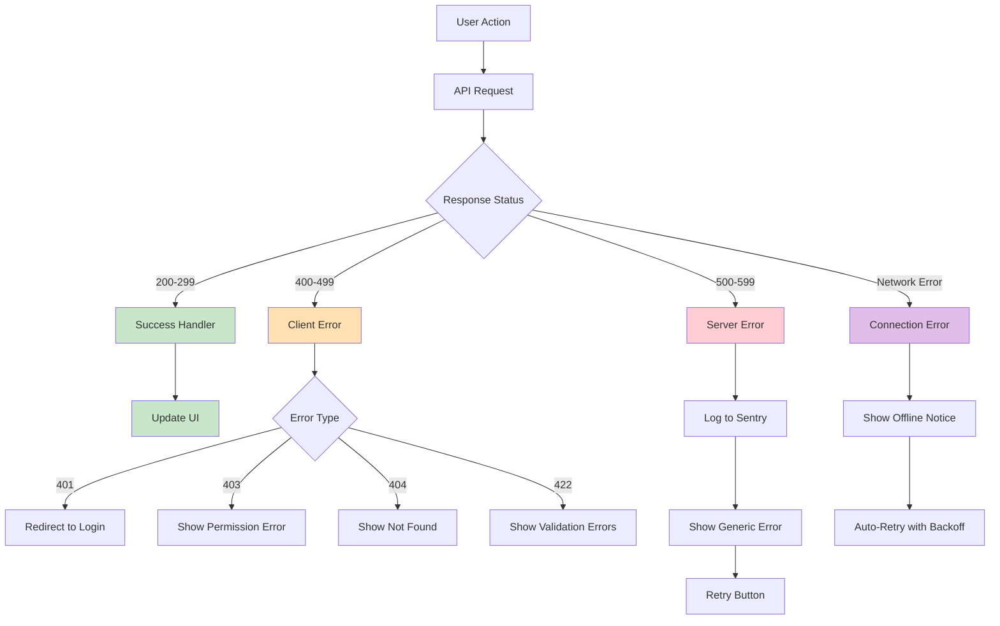

## Real-Time Updates (Future)

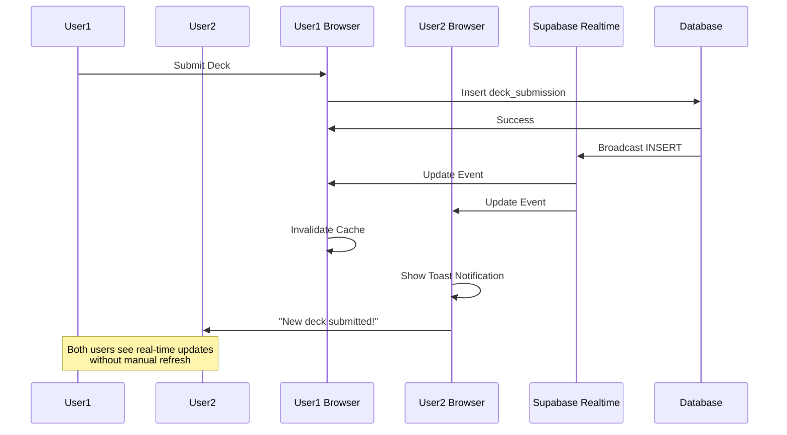

## Performance Monitoring Data Flow

```mermaid
flowchart LR
    A[User Action] --> B[Next.js App]
    B --> C[Web Vitals]
    C --> D{Metrics}

    D --> E[LCP<br/>Largest Contentful Paint]
    D --> F[FID<br/>First Input Delay]
    D --> G[CLS<br/>Cumulative Layout Shift]

    E --> H[Vercel Analytics]
    F --> H
    G --> H

    B --> I[API Response Times]
    I --> J[/api/metrics endpoint]

    B --> K[Error Boundary]
    K --> L[Sentry]

    style C fill:#fff9c4
    style H fill:#3ecf8e
    style J fill:#e1bee7
    style L fill:#e74c3c
```

## Summary of Data Flow Principles

1. **Server-First**: Data fetching happens on the server when possible
2. **Progressive Enhancement**: Basic functionality works without JS
3. **Optimistic Updates**: UI updates immediately, then confirms with server
4. **Smart Caching**: 5-minute stale time, 10-minute garbage collection
5. **Three-Tier Access**: Browser (public) → Server (user) → Admin (privileged)
6. **Error Resilience**: Automatic retries with exponential backoff
7. **Type Safety**: End-to-end TypeScript from DB to UI
