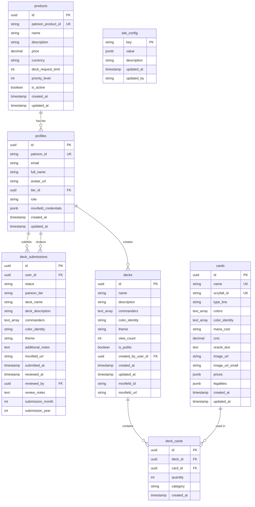

# DefCat DeckVault - Database Schema

## Entity Relationship Diagram



## Table Descriptions

### profiles
**Purpose**: User accounts with Patreon integration

**Key Fields**:
- `patreon_id`: Unique identifier from Patreon OAuth
- `tier_id`: References products table for subscription tier
- `role`: Access level (user, moderator, admin)
- `moxfield_credentials`: Encrypted Moxfield API tokens

**Indexes**:
- `patreon_id` (unique)
- `email` (unique)
- `tier_id` (foreign key)

**RLS Policies**:
- Users can read their own profile
- Admins can read all profiles
- Users can update their own non-role fields

---

### products
**Purpose**: Patreon tier definitions

**Key Fields**:
- `patreon_product_id`: Synced from Patreon API
- `deck_request_limit`: Monthly submission quota per tier
- `priority_level`: Queue priority (higher = faster processing)

**Indexes**:
- `patreon_product_id` (unique)
- `is_active`

**RLS Policies**:
- Public read access
- Admin-only write access

---

### decks
**Purpose**: Commander deck metadata

**Key Fields**:
- `commanders`: Array of commander card names
- `color_identity`: Normalized WUBRG format
- `moxfield_id`: Link to Moxfield deck
- `view_count`: Popularity metric

**Indexes**:
- `color_identity` (for filtering)
- `created_by_user_id` (foreign key)
- `moxfield_id` (unique, nullable)
- `is_public`

**RLS Policies**:
- Public read for `is_public = true`
- Creator can read their own private decks
- Admin can read all decks

---

### cards
**Purpose**: MTG card cache from Scryfall

**Key Fields**:
- `scryfall_id`: Unique Scryfall identifier
- `color_identity`: Normalized for commander legality
- `prices`: JSONB with market pricing data
- `legalities`: JSONB with format legality

**Indexes**:
- `name` (unique, case-insensitive)
- `scryfall_id` (unique)
- `color_identity` (GIN index for array queries)

**RLS Policies**:
- Public read access
- Admin-only write access

---

### deck_cards
**Purpose**: Many-to-many relationship between decks and cards

**Key Fields**:
- `quantity`: Number of copies (typically 1 for Commander)
- `category`: Card role (commander, creature, instant, etc.)

**Indexes**:
- `deck_id` (foreign key)
- `card_id` (foreign key)
- Composite unique: `(deck_id, card_id)`

**RLS Policies**:
- Inherits from decks table
- Read access matches deck access

---

### deck_submissions
**Purpose**: User deck submission requests

**Key Fields**:
- `status`: pending, approved, rejected, completed
- `submission_month/year`: For monthly limit tracking
- `reviewed_by`: Admin who processed the submission

**Indexes**:
- `user_id` (foreign key)
- `status`
- Composite: `(user_id, submission_month, submission_year)`

**RLS Policies**:
- Users can read their own submissions
- Users can create submissions (with rate limiting)
- Admins can read/update all submissions

---

### site_config
**Purpose**: Application configuration key-value store

**Key Fields**:
- `key`: Configuration identifier
- `value`: JSONB flexible value storage
- `updated_by`: Audit trail

**Indexes**:
- `key` (primary key)

**RLS Policies**:
- Public read access
- Admin-only write access

## Relationships

### One-to-Many
1. **products → profiles**: Each user has one tier
2. **profiles → deck_submissions**: Users submit multiple requests
3. **profiles → decks**: Users create multiple decks
4. **decks → deck_cards**: Decks contain many cards

### Many-to-Many
1. **decks ↔ cards**: Through `deck_cards` join table

### Self-Referencing
1. **profiles → deck_submissions**: `reviewed_by` field

## Data Integrity

### Foreign Key Constraints
```sql
deck_submissions.user_id → profiles.id (ON DELETE CASCADE)
deck_submissions.reviewed_by → profiles.id (ON DELETE SET NULL)
deck_cards.deck_id → decks.id (ON DELETE CASCADE)
deck_cards.card_id → cards.id (ON DELETE RESTRICT)
profiles.tier_id → products.id (ON DELETE SET NULL)
decks.created_by_user_id → profiles.id (ON DELETE SET NULL)
```

### Unique Constraints
- `profiles.patreon_id`
- `profiles.email`
- `products.patreon_product_id`
- `cards.name` (case-insensitive)
- `cards.scryfall_id`
- `deck_cards(deck_id, card_id)` composite

### Check Constraints
- `deck_submissions.status` IN ('pending', 'approved', 'rejected', 'completed')
- `profiles.role` IN ('user', 'moderator', 'admin')
- `deck_cards.quantity` > 0

## Migration Strategy

All schema changes are managed through Supabase migrations:
- Location: `supabase/migrations/`
- Naming: `YYYYMMDDHHMMSS_description.sql`
- Applied sequentially in timestamp order

## Query Optimization

### Common Query Patterns

**1. Get user's deck with cards**
```sql
SELECT
    d.*,
    json_agg(json_build_object(
        'card', c,
        'quantity', dc.quantity,
        'category', dc.category
    )) as cards
FROM decks d
JOIN deck_cards dc ON d.id = dc.deck_id
JOIN cards c ON dc.card_id = c.id
WHERE d.id = $1
GROUP BY d.id;
```
*Indexes used*: `decks.id`, `deck_cards.deck_id`, `deck_cards.card_id`

**2. Check monthly submission limit**
```sql
SELECT COUNT(*)
FROM deck_submissions
WHERE user_id = $1
    AND submission_month = $2
    AND submission_year = $3
    AND status != 'rejected';
```
*Indexes used*: `(user_id, submission_month, submission_year)` composite

**3. Filter decks by color identity**
```sql
SELECT * FROM decks
WHERE color_identity = 'BRG'
    AND is_public = true
ORDER BY view_count DESC
LIMIT 20;
```
*Indexes used*: `color_identity`, `is_public`, `view_count`

## Backup and Recovery

- **Automated backups**: Daily at 2 AM UTC
- **Point-in-time recovery**: 7-day window
- **Backup location**: Supabase managed storage
- **Recovery time objective (RTO)**: < 1 hour
- **Recovery point objective (RPO)**: < 24 hours

## Future Schema Enhancements

1. **deck_versions**: Track deck evolution over time
2. **card_tags**: Custom tags for organization
3. **deck_comments**: Community feedback system
4. **deck_favorites**: User bookmarks
5. **deck_stats**: Cached analytics (avg CMC, color distribution)
6. **webhook_logs**: Patreon webhook processing audit
