# Database Schema (Entity Relationship Diagram)

This diagram shows the complete database schema for DefCat's DeckVault, including all tables, relationships, and key fields.

```mermaid
erDiagram
    profiles ||--o{ deck_submissions : "submits"
    profiles ||--o| user_credits : "has"
    profiles {
        text id PK
        text email UK
        text patreon_id UK
        patreon_tier patreon_tier
        text moxfield_username
        text role "default: user"
        timestamptz created_at
        timestamptz updated_at
    }

    moxfield_decks ||--o{ decklist_cards : "contains"
    moxfield_decks {
        serial id PK
        text moxfield_id UK
        text name
        text author_name
        text author_username
        text format
        text visibility
        int commanders_count
        int mainboard_count
        int sideboard_count
        int view_count
        int like_count
        int comment_count
        jsonb raw_data
        timestamptz created_at
        timestamptz fetched_at
        timestamptz cards_fetched_at
        timestamptz last_updated_at
    }

    cards ||--o{ decklist_cards : "used_in"
    cards {
        text id PK
        text name
        text scryfall_id
        text mana_cost
        numeric cmc
        text type_line
        text oracle_text
        text[] colors
        text[] color_identity
        text rarity
        text set_code
        text set_name
        text image_url
        text cached_image_url
        int cache_attempts
        text cache_error
        timestamptz last_cache_attempt_at
        jsonb prices
        timestamptz created_at
    }

    decklist_cards {
        serial id PK
        text moxfield_deck_id FK
        text card_id FK
        text card_name
        text board "mainboard/sideboard/commanders"
        int quantity
        jsonb card_data
        timestamptz fetched_at
    }

    deck_submissions {
        text id PK
        text user_id FK
        text patreon_id
        text patreon_username
        text patreon_tier
        text email
        text discord_username
        text moxfield_username
        submission_type submission_type "deck/roast"
        boolean mystery_deck
        text commander
        text color_preference
        text theme
        text bracket
        text budget
        text ideal_date
        text deck_list_url
        text coffee_preference
        text notes
        text status "pending/in_progress/completed"
        text submission_month
        timestamptz created_at
        timestamptz updated_at
    }

    user_credits {
        text user_id PK,FK
        jsonb credits "structured credit data"
        jsonb last_granted "last grant metadata"
        timestamptz created_at
        timestamptz updated_at
    }

    tiers ||--o{ tier_benefits : "provides"
    tiers {
        text id PK
        text display_name
        int sort_order
        boolean is_active
        timestamptz created_at
    }

    credit_types ||--o{ tier_benefits : "assigned_to"
    credit_types {
        text id PK
        text display_name
        text description
        boolean is_active
        timestamptz created_at
    }

    tier_benefits {
        text tier_id PK,FK
        text credit_type_id PK,FK
        int amount
    }

    products {
        text id PK
        text key UK
        text name
        text description
        text link
        text image_url
        text category
        int sort_order
        boolean is_active
        timestamptz created_at
        timestamptz updated_at
    }

    site_config {
        text id PK
        text key UK
        text value
        text category
        text description
        boolean is_sensitive
        timestamptz created_at
        timestamptz updated_at
    }

    update_logs {
        text id PK
        text operation_type
        text status
        int total_items
        int processed_count
        int success_count
        int failed_count
        int skipped_count
        text error_message
        jsonb error_details
        jsonb metadata
        int duration_ms
        text triggered_by
        timestamptz started_at
        timestamptz completed_at
    }

    bookmark_sync_logs {
        text id PK
        text bookmark_id
        text status
        int total_decks
        int inserted_decks
        int updated_decks
        int unchanged_decks
        int duration_ms
        text error_message
        timestamptz started_at
        timestamptz completed_at
    }
```

## Key Relationships

1. **profiles** → **deck_submissions**: One-to-many relationship for user submissions
2. **profiles** → **user_credits**: One-to-one relationship for credit tracking
3. **moxfield_decks** → **decklist_cards**: One-to-many for deck composition
4. **cards** → **decklist_cards**: One-to-many for card usage across decks
5. **tiers** → **tier_benefits**: One-to-many for tier-specific credit allocations
6. **credit_types** → **tier_benefits**: One-to-many for credit type assignments

## Enums

- **patreon_tier**: Citizen, Knight, Emissary, Duke, Wizard, ArchMage
- **submission_type**: deck, roast
- **user_role**: user, member, moderator, administrator, developer

## Special Features

1. **Row Level Security (RLS)**: Enabled on all tables with policies for user/admin access
2. **Triggers**: Auto-update timestamps on profiles, decks, submissions, products, site_config
3. **Views**:
   - `deck_list_view`: Simplified deck browsing
   - `unified_deck_view`: Comprehensive deck data with analytics
   - `user_credit_details`: Expanded credit information
   - `submission_stats`: Aggregated submission statistics
   - `tier_benefit_matrix`: Credit benefits by tier
4. **Functions**:
   - `use_credit()`: Deduct credits from user
   - `refund_credit()`: Return credits to user
   - `refresh_user_credits()`: Reset monthly credits
   - `distribute_monthly_credits()`: Batch credit distribution
   - `import_deck_from_jsonb()`: Bulk deck import
