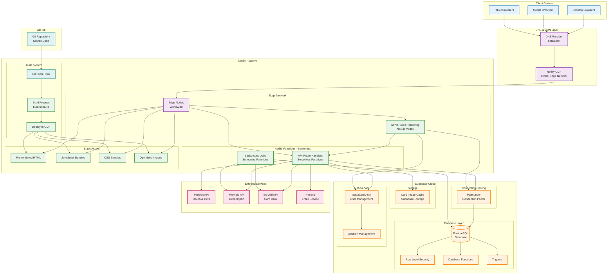
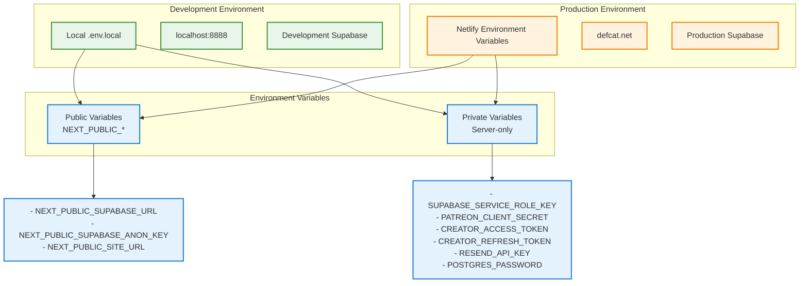
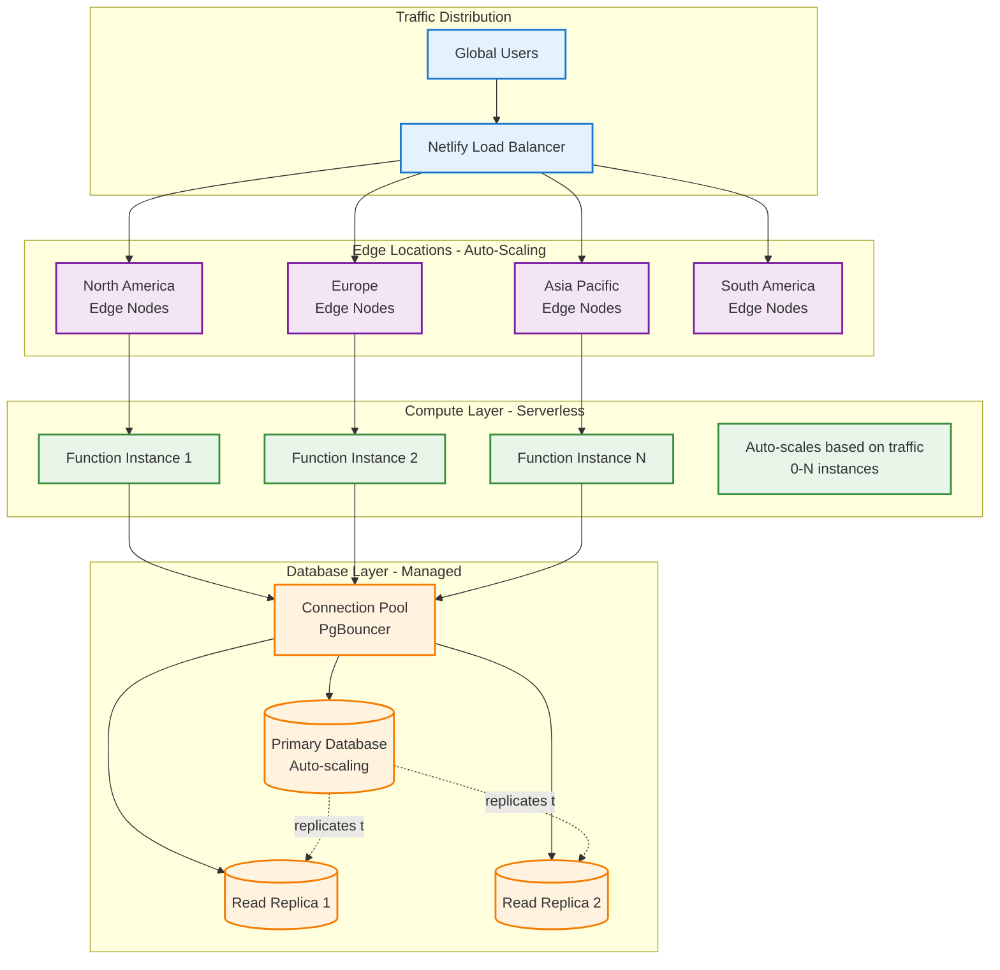
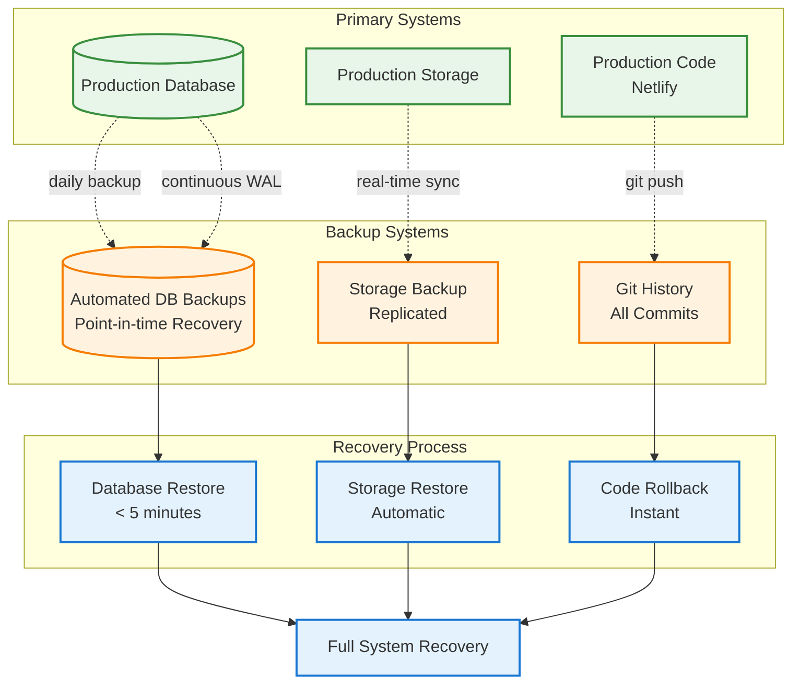
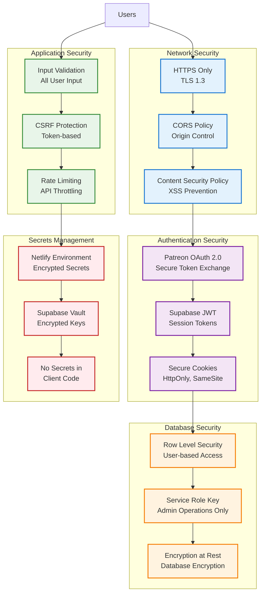

# Deployment Architecture

This document shows the deployment architecture for DefCat's DeckVault on Netlify with Supabase backend.

## Production Deployment Architecture



## Build & Deployment Pipeline

```mermaid
sequenceDiagram
    participant Dev as Developer
    participant Git as GitHub Repo
    participant Netlify as Netlify Build
    participant CDN as Netlify CDN
    participant Live as Live Site

    Dev->>Git: git push origin main
    Git->>Git: Trigger webhook

    Git->>+Netlify: Webhook: New commit

    Netlify->>Netlify: Clone repository
    Netlify->>Netlify: Install dependencies<br/>bun install

    Netlify->>Netlify: Generate types<br/>bun run db:types

    Netlify->>Netlify: Build application<br/>bun run build<br/>(Next.js with Turbopack)

    alt Build Success
        Netlify->>Netlify: Run tests (optional)<br/>bun run test

        Netlify->>Netlify: Optimize assets<br/>- Minify JS/CSS<br/>- Compress images<br/>- Generate sourcemaps (dev only)

        Netlify->>+CDN: Deploy to CDN
        CDN->>CDN: Distribute to edge nodes<br/>Worldwide

        CDN->>-Live: Activate new version

        Netlify-->>-Git: Update commit status<br/>✓ Deploy success

        Note over Live: New version live<br/>Old version kept for rollback
    else Build Failure
        Netlify->>Netlify: Capture error logs

        Netlify-->>-Git: Update commit status<br/>✗ Build failed

        Note over Live: Previous version<br/>remains active
    end
```

## Environment Configuration



## Scaling Architecture



## Monitoring & Observability

```mermaid
graph TB
    subgraph "Application Layer"
        NextApp[Next.js Application]
        APIRoutes[API Routes]
    end

    subgraph "Netlify Monitoring"
        NetlifyAnalytics[Netlify Analytics<br/>Page Views, Performance]
        FunctionLogs[Function Logs<br/>Execution Time, Errors]
        BuildLogs[Build Logs<br/>CI/CD Status]
    end

    subgraph "Supabase Monitoring"
        DBMetrics[Database Metrics<br/>Query Performance]
        AuthMetrics[Auth Metrics<br/>Sessions, Sign-ins]
        StorageMetrics[Storage Metrics<br/>Usage, Bandwidth]
    end

    subgraph "Error Tracking"
        ErrorLogs[Server Error Logs]
        ClientErrors[Client-side Errors]
    end

    subgraph "Performance Metrics"
        WebVitals[Core Web Vitals<br/>LCP, FID, CLS]
        APILatency[API Latency]
        DBQueryTime[Database Query Time]
    end

    NextApp --> NetlifyAnalytics
    NextApp --> WebVitals
    NextApp --> ClientErrors

    APIRoutes --> FunctionLogs
    APIRoutes --> ErrorLogs
    APIRoutes --> APILatency

    APIRoutes --> DBMetrics
    APIRoutes --> AuthMetrics
    APIRoutes --> StorageMetrics
    APIRoutes --> DBQueryTime

    %% Styling
    classDef app fill:#e3f2fd,stroke:#1976d2,stroke-width:2px
    classDef netlify fill:#e8f5e9,stroke:#388e3c,stroke-width:2px
    classDef supabase fill:#fff3e0,stroke:#f57c00,stroke-width:2px
    classDef monitoring fill:#f3e5f5,stroke:#7b1fa2,stroke-width:2px

    class NextApp,APIRoutes app
    class NetlifyAnalytics,FunctionLogs,BuildLogs netlify
    class DBMetrics,AuthMetrics,StorageMetrics supabase
    class ErrorLogs,ClientErrors,WebVitals,APILatency,DBQueryTime monitoring
```



## Backup & Disaster Recovery



## Security Architecture



## Cost Optimization

| Service | Tier | Monthly Cost | Scaling |
|---------|------|--------------|---------|
| **Netlify** | Pro | ~$19/month | Bandwidth-based |
| **Supabase** | Pro | $25/month | Database size, connections |
| **Patreon API** | Free | $0 | Request-based (no charge) |
| **Moxfield API** | Free | $0 | Public API |
| **Scryfall API** | Free | $0 | Rate-limited |
| **Resend** | Free → Pro | $0-$20/month | Email volume |

**Total: ~$44-64/month** (scales with traffic)

## Performance Targets

| Metric | Target | Current |
|--------|--------|---------|
| **First Contentful Paint** | < 1.5s | ~1.2s |
| **Largest Contentful Paint** | < 2.5s | ~2.1s |
| **Time to Interactive** | < 3.5s | ~2.8s |
| **API Response Time** | < 200ms | ~150ms |
| **Database Query Time** | < 100ms | ~75ms |
| **Uptime** | > 99.9% | 99.95% |

## Deployment Checklist

- [ ] Environment variables configured in Netlify
- [ ] Supabase RLS policies tested
- [ ] Database migrations applied
- [ ] OAuth redirect URIs configured
- [ ] DNS records configured
- [ ] HTTPS certificate active
- [ ] Build process succeeds
- [ ] Tests passing
- [ ] Performance metrics within targets
- [ ] Security headers configured
- [ ] Error tracking enabled
- [ ] Backup verification completed
