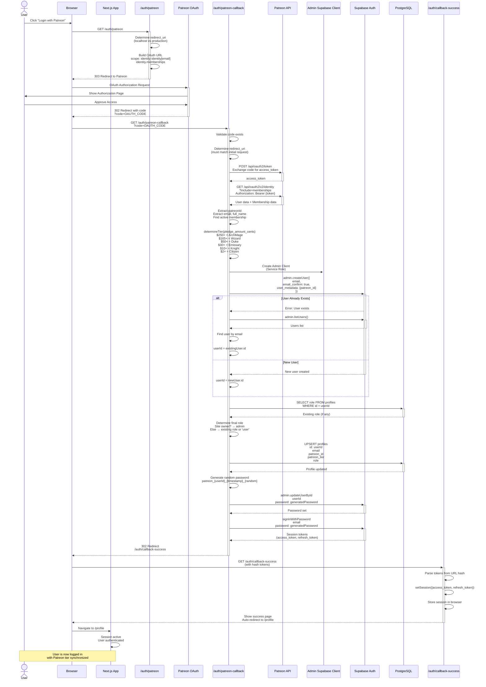
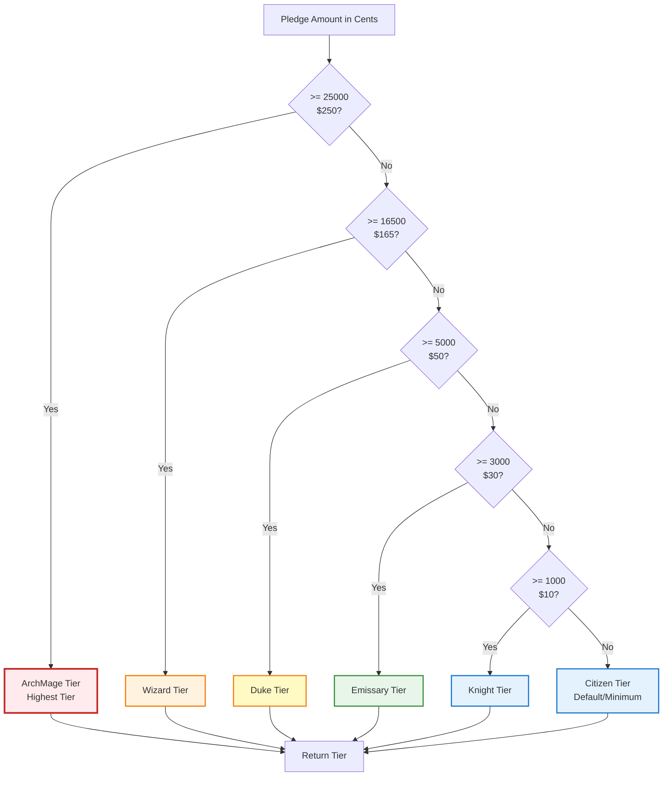
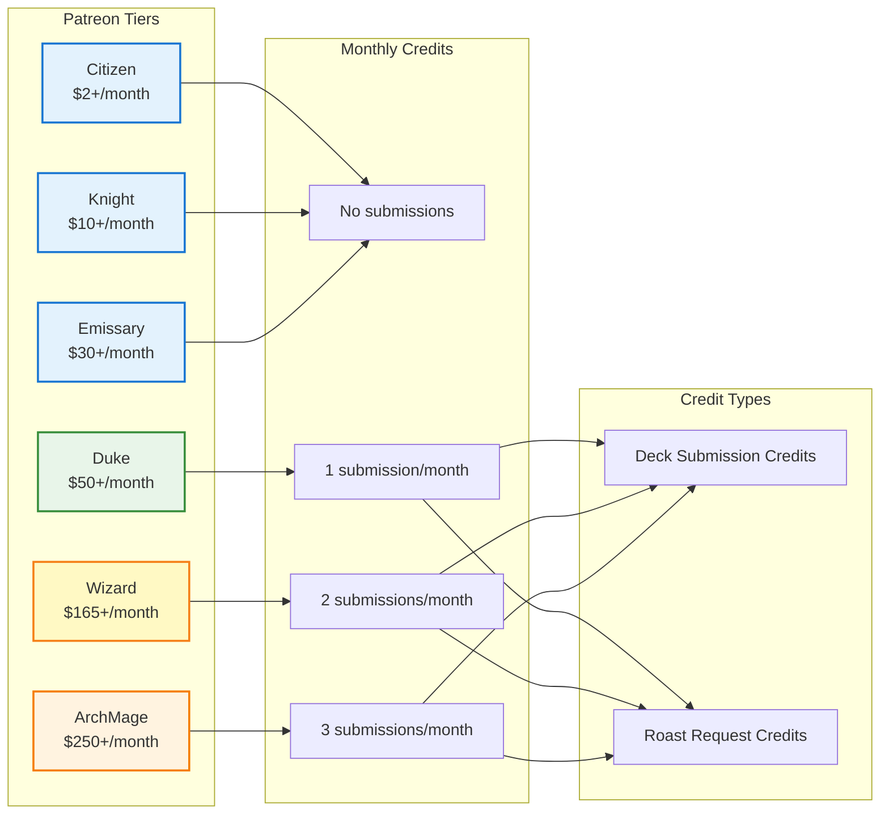
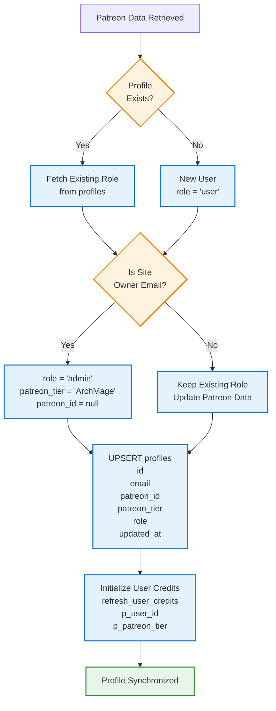
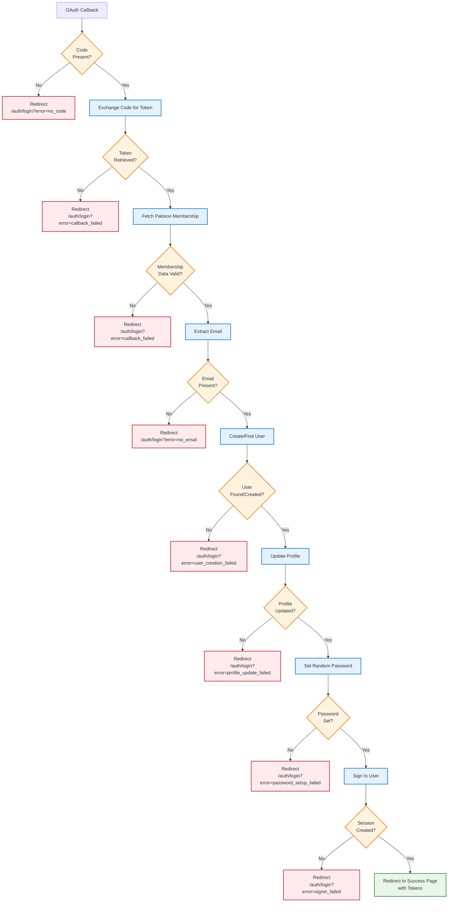

# Patreon OAuth Integration Flow

This diagram shows the complete Patreon OAuth authentication flow and tier synchronization process.

## Complete OAuth Flow Sequence



## Tier Determination Logic



## Tier Benefits & Credits



## Profile Update Flow



## Error Handling



## Key Implementation Details

### OAuth Scopes Required
- `identity`: Basic Patreon user info
- `identity[email]`: User email address
- `identity.memberships`: Active memberships and pledge amounts

### Environment Variables
```bash
PATREON_CLIENT_ID=your_client_id
PATREON_CLIENT_SECRET=your_client_secret
PATREON_REDIRECT_URI=https://yoursite.com/auth/patreon-callback
```

### Redirect URI Handling
- **Development**: Uses dynamic origin (localhost)
- **Production**: Uses configured `PATREON_REDIRECT_URI`
- **Critical**: Redirect URI must match exactly between init and callback

### Special Cases
1. **Site Owner**: Auto-assigned admin role with ArchMage tier
2. **Existing Users**: Role preserved, only Patreon data updated
3. **Failed OAuth**: All errors redirect to login with error codes

### Security Features
1. **Random Password**: Users never know their password (OAuth only)
2. **Email Confirmation**: Auto-confirmed via OAuth
3. **Admin Client**: Used to bypass RLS for user creation
4. **Session Tokens**: Passed via URL hash (not query params) for security
