# System Architecture

This diagram shows the complete system architecture for DefCat's DeckVault, including all major components, services, and data flows.

```mermaid
graph TB
    subgraph "External Services"
        Patreon[Patreon OAuth API]
        Moxfield[Moxfield API]
        Scryfall[Scryfall API]
        Resend[Resend Email Service]
    end

    subgraph "Client Layer"
        Browser[Web Browser]
        Mobile[Mobile Browser]
    end

    subgraph "CDN & Edge"
        Netlify[Netlify Edge Network]
        NetlifyFunctions[Netlify Functions]
    end

    subgraph "Next.js Application - Port 8888"
        direction TB

        subgraph "Frontend - React 19"
            Pages[App Router Pages]
            ServerComponents[Server Components]
            ClientComponents[Client Components]
            Providers[Context Providers]
        end

        subgraph "Middleware Layer"
            NextMiddleware[Next.js Middleware]
            SupabaseMiddleware[Supabase Session Refresh]
            AdminGuard[Admin Route Protection]
        end

        subgraph "API Routes"
            PublicAPI[Public API Routes]
            AdminAPI[Admin API Routes]
            AuthAPI[Auth API Routes]
            HealthAPI[Health/Metrics Routes]
        end

        subgraph "Server-Side Logic"
            ServerAuth[Server Auth Guards]
            APIAuth[API Auth Guards]
            DataFetching[Data Fetching Utils]
        end

        subgraph "Client State Management"
            TanStackQuery[TanStack Query]
            ReactContext[React Contexts]
            LocalState[Component State]
        end

        subgraph "Supabase Client Architecture"
            BrowserClient[Browser Client<br/>createBrowserClient]
            ServerClient[Server Client<br/>createServerClient]
            AdminClient[Admin Client<br/>Service Role]
        end
    end

    subgraph "Backend Services"
        direction TB

        Supabase[(Supabase)]

        subgraph "Supabase Components"
            SupabaseAuth[Supabase Auth]
            SupabaseDB[PostgreSQL Database]
            SupabaseStorage[Storage Buckets]
            SupabaseRLS[Row Level Security]
        end

        subgraph "Database Features"
            Tables[Tables]
            Views[Views]
            Functions[Functions]
            Triggers[Triggers]
            RLSPolicies[RLS Policies]
        end
    end

    subgraph "Background Jobs & Scripts"
        FetchDecks[Fetch Decks Script]
        FetchImages[Fetch Images Script]
        CleanupCache[Cleanup Phantom Cache]
        SeedConfig[Seed Configuration]
        CreditDistribution[Monthly Credit Distribution]
    end

    %% External Connections
    Browser --> Netlify
    Mobile --> Netlify
    Netlify --> NextMiddleware

    %% Middleware Flow
    NextMiddleware --> SupabaseMiddleware
    SupabaseMiddleware --> AdminGuard
    AdminGuard --> Pages

    %% Page Rendering
    Pages --> ServerComponents
    Pages --> ClientComponents
    ServerComponents --> ServerAuth
    ServerComponents --> ServerClient
    ClientComponents --> BrowserClient
    ClientComponents --> TanStackQuery

    %% Context & State
    Providers --> ReactContext
    Providers --> TanStackQuery
    ClientComponents --> LocalState

    %% API Layer
    Pages --> PublicAPI
    Pages --> AdminAPI
    Pages --> AuthAPI
    ClientComponents --> PublicAPI

    PublicAPI --> APIAuth
    AdminAPI --> APIAuth
    AuthAPI --> ServerClient

    %% Auth Guards
    ServerAuth --> ServerClient
    APIAuth --> ServerClient

    %% Supabase Clients
    BrowserClient --> SupabaseAuth
    ServerClient --> SupabaseAuth
    ServerClient --> SupabaseDB
    AdminClient --> SupabaseDB
    AdminClient -.bypasses.-> SupabaseRLS

    %% Database Structure
    SupabaseDB --> Tables
    SupabaseDB --> Views
    SupabaseDB --> Functions
    SupabaseDB --> Triggers
    SupabaseRLS --> RLSPolicies

    %% External API Integrations
    AuthAPI --> Patreon
    FetchDecks --> Moxfield
    FetchImages --> Scryfall
    PublicAPI --> Scryfall
    AdminAPI --> Resend

    %% Background Jobs
    FetchDecks --> AdminClient
    FetchImages --> AdminClient
    CleanupCache --> SupabaseStorage
    SeedConfig --> AdminClient
    CreditDistribution --> Functions

    %% Storage
    ServerClient --> SupabaseStorage
    AdminClient --> SupabaseStorage

    %% Netlify Functions
    NetlifyFunctions -.serverless.-> AdminAPI

    %% Styling
    classDef external fill:#e3f2fd,stroke:#1976d2,stroke-width:2px
    classDef client fill:#f3e5f5,stroke:#7b1fa2,stroke-width:2px
    classDef server fill:#e8f5e9,stroke:#388e3c,stroke-width:2px
    classDef database fill:#fff3e0,stroke:#f57c00,stroke-width:2px
    classDef auth fill:#fce4ec,stroke:#c2185b,stroke-width:2px
    classDef background fill:#e0f2f1,stroke:#00796b,stroke-width:2px

    class Patreon,Moxfield,Scryfall,Resend external
    class Browser,Mobile,ClientComponents,BrowserClient,TanStackQuery,ReactContext client
    class ServerComponents,ServerClient,ServerAuth,APIAuth,PublicAPI,AdminAPI server
    class SupabaseDB,Tables,Views,Functions,Triggers database
    class SupabaseAuth,SupabaseMiddleware,AdminGuard,RLSPolicies auth
    class FetchDecks,FetchImages,CleanupCache,SeedConfig,CreditDistribution background
```

## Architecture Highlights

### Frontend Layer
- **Next.js 16** with App Router and Turbopack
- **React 19** Server Components for performance
- **Client Components** for interactivity
- **TanStack Query** for server state management
- **Tailwind CSS v4** with shadcn/ui components

### Middleware Layer
- **Session Management**: Auto-refresh Supabase sessions
- **Route Protection**: Admin routes require authentication
- **Cookie Handling**: Secure session cookie management

### Three-Tier Supabase Architecture
1. **Browser Client**: Client-side operations in browser
2. **Server Client**: Server Components & Route Handlers with RLS
3. **Admin Client**: Service role bypasses RLS for admin operations

### API Routes Structure
- `/api/health` - Health checks
- `/api/metrics` - Application metrics
- `/api/card-image` - Card image proxy
- `/api/submit-deck` - Deck submissions
- `/api/submit-roast` - Roast submissions
- `/api/admin/*` - Admin operations (protected)

### External Integrations
1. **Patreon**: OAuth authentication, tier verification
2. **Moxfield**: Deck data import via public API
3. **Scryfall**: Card data and image fetching
4. **Resend**: Transactional email delivery

### Background Processing
- **Deck Import**: Scheduled Moxfield bookmark sync
- **Image Caching**: Scryfall image pre-fetch to Supabase Storage
- **Cache Cleanup**: Remove phantom cached images
- **Credit Distribution**: Monthly tier-based credit allocation

### Security Features
- **Row Level Security**: Database-level access control
- **Role-Based Auth**: user → member → moderator → admin → developer
- **Auth Guards**: Separate guards for pages vs API routes
- **Service Role**: Admin client for privileged operations
