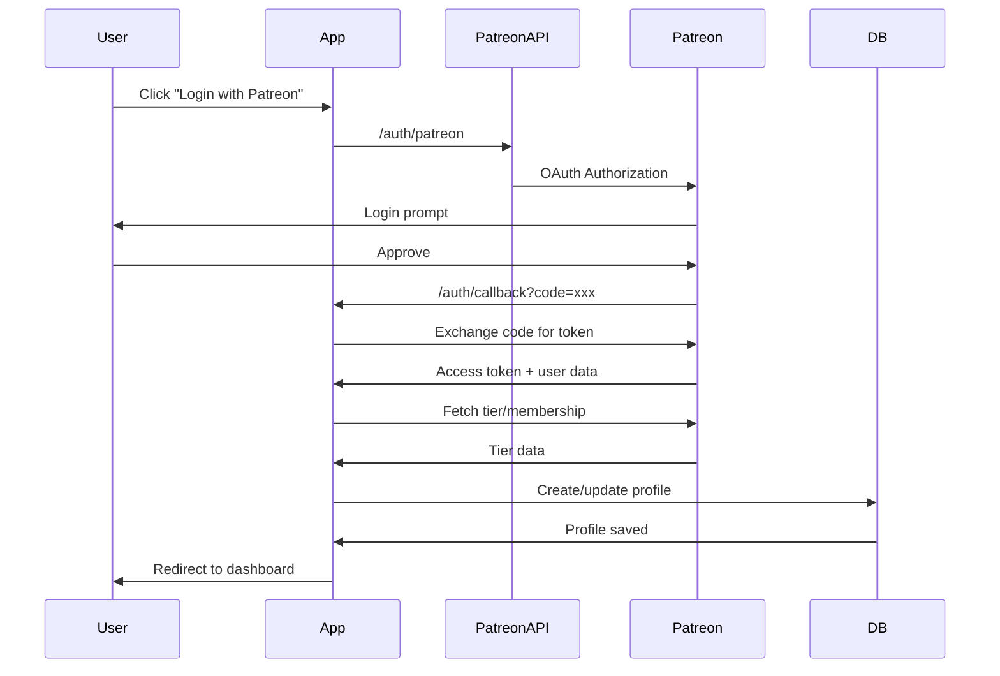
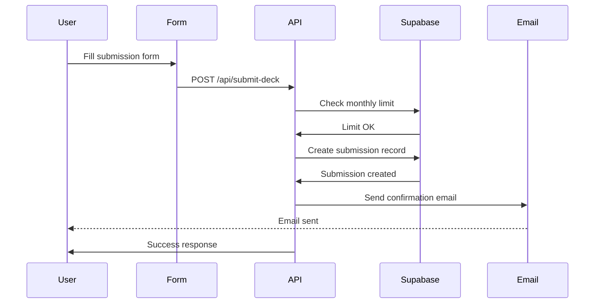
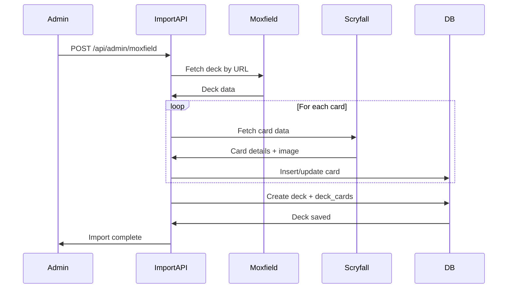

# DefCat DeckVault - System Architecture

## Overview
DefCat DeckVault is a full-stack Next.js application for managing Magic: The Gathering Commander deck submissions with Patreon-based tier access control.

## System Architecture Diagram

```mermaid
---
type: ELK
name: "System Architecture"
theme: Neo Dark
---
graph TB
    subgraph "External Services"
        Patreon[Patreon OAuth API]
        Moxfield[Moxfield API]
        Scryfall[Scryfall API]
        Resend[Resend Email Service]
    end

    subgraph "Client Layer - Browser"
        User[User Browser]
    end

    subgraph "Presentation Layer - Next.js App Router"
        subgraph "Public Pages"
            Home[Home Page<br/>src/app/page.tsx]
            About[About Page<br/>src/app/about/page.tsx]
            Decks[Deck Browser<br/>src/app/decks/page.tsx]
            DeckDetail[Deck Detail<br/>src/app/decks/id/page.tsx]
        end

        subgraph "Auth Pages"
            Login[Login<br/>src/app/auth/login/page.tsx]
            AuthCallback[OAuth Callback<br/>src/app/auth/callback/route.ts]
            Verify[Verify<br/>src/app/auth/verify/page.tsx]
        end

        subgraph "User Pages"
            Profile[Profile<br/>src/app/profile]
            DeckSubmission[Deck Submission<br/>src/app/decks/submission/page.tsx]
            RoastSubmission[Roast Submission<br/>src/app/decks/roast-submission/page.tsx]
        end

        subgraph "Admin Pages"
            AdminDash[Admin Dashboard<br/>src/app/admin/page.tsx]
            AdminUsers[User Management<br/>src/app/admin/users/page.tsx]
            AdminDecks[Deck Management<br/>src/app/admin/decks/page.tsx]
            AdminDB[Database Tools<br/>src/app/admin/database/page.tsx]
            AdminProducts[Product Management<br/>src/app/admin/products/page.tsx]
        end
    end

    subgraph "API Layer - Next.js API Routes"
        subgraph "Public APIs"
            HealthAPI[Health Check<br/>/api/health]
            MetricsAPI[Metrics<br/>/api/metrics]
            CardImageAPI[Card Images<br/>/api/card-image]
        end

        subgraph "Auth APIs"
            PatreonAPI[Patreon OAuth<br/>/api/auth/patreon]
            CallbackAPI[OAuth Callback<br/>/api/auth/callback]
            LogoutAPI[Logout<br/>/api/auth/logout]
        end

        subgraph "User APIs"
            SubmitDeckAPI[Submit Deck<br/>/api/submit-deck]
            SubmitRoastAPI[Submit Roast<br/>/api/submit-roast]
        end

        subgraph "Admin APIs"
            AdminDeckAPI[Admin Decks<br/>/api/admin/decks]
            AdminUserAPI[Admin Users<br/>/api/admin/users]
            AdminProductAPI[Admin Products<br/>/api/admin/products]
            AdminQueryAPI[Database Query<br/>/api/admin/database/query]
            MoxfieldImportAPI[Moxfield Import<br/>/api/admin/moxfield]
        end
    end

    subgraph "Business Logic Layer - lib/"
        subgraph "Authentication"
            AuthLib[Auth Module<br/>src/lib/auth]
            SessionMgmt[Session Management]
        end

        subgraph "Data Access - Three-Tier Pattern"
            ClientLib[Browser Client<br/>src/lib/supabase/client.ts<br/>Anon Key - Read Only]
            ServerLib[Server Client<br/>src/lib/supabase/server.ts<br/>Full Access]
            AdminLib[Admin Client<br/>src/lib/supabase/admin.ts<br/>Service Role - Bypass RLS]
        end

        subgraph "External Integrations"
            PatreonLib[Patreon Integration<br/>src/lib/api/patreon]
            MoxfieldLib[Moxfield Integration<br/>src/lib/api/moxfield]
            ScryfallLib[Scryfall Integration<br/>src/lib/api/scryfall]
            EmailLib[Email Service<br/>src/lib/api/resend]
        end

        subgraph "Utilities"
            ColorIdentity[Color Identity Utils<br/>src/lib/utility/color-identity]
            Cache[Cache Layer<br/>src/lib/cache]
            Hooks[React Hooks<br/>src/lib/hooks]
            Contexts[React Contexts<br/>src/lib/contexts]
        end
    end

    subgraph "Component Layer - components/"
        subgraph "UI Components"
            BaseUI[Base UI<br/>src/components/ui<br/>shadcn/ui patterns]
            MagicUI[MTG Components<br/>src/components/magicui<br/>Mana symbols, cards]
        end

        subgraph "Feature Components"
            AuthComp[Auth Components<br/>src/components/auth]
            DeckComp[Deck Components<br/>src/components/decks]
            AdminComp[Admin Components<br/>src/components/admin]
            ProfileComp[Profile Components<br/>src/components/profile]
            LayoutComp[Layout Components<br/>src/components/layout]
        end
    end

    subgraph "Data Layer"
        subgraph "Supabase PostgreSQL"
            ProfilesTable[(profiles table<br/>User data, Patreon tier)]
            DecksTable[(decks table<br/>Deck metadata)]
            CardsTable[(cards table<br/>Card cache from Scryfall)]
            DeckCardsTable[(deck_cards table<br/>Many-to-many)]
            SubmissionsTable[(deck_submissions table<br/>Submission tracking)]
            ProductsTable[(products table<br/>Patreon products)]
        end

        subgraph "Storage"
            ImageStorage[(Supabase Storage<br/>Card images)]
        end
    end

    subgraph "Type System - types/"
        CoreTypes[Core Types<br/>src/types/core.ts<br/>Deck, Card, User]
        SupabaseTypes[Supabase Types<br/>src/types/supabase.ts<br/>Generated DB types]
        FormTypes[Form Types<br/>src/types/form.ts]
        MoxfieldTypes[Moxfield Types<br/>src/types/moxfield.ts]
    end

    User --> Home
    User --> About
    User --> Decks
    User --> Login

    Home --> BaseUI
    Decks --> DeckComp
    DeckDetail --> MagicUI

    Login --> AuthComp
    Login --> PatreonAPI

    PatreonAPI --> AuthLib
    AuthLib --> Patreon
    CallbackAPI --> PatreonLib
    PatreonLib --> Patreon

    DeckSubmission --> SubmitDeckAPI
    SubmitDeckAPI --> ServerLib
    SubmitDeckAPI --> EmailLib
    EmailLib --> Resend

    AdminDecks --> AdminDeckAPI
    AdminDeckAPI --> AdminLib
    AdminLib --> DecksTable

    MoxfieldImportAPI --> MoxfieldLib
    MoxfieldLib --> Moxfield
    MoxfieldImportAPI --> ScryfallLib
    ScryfallLib --> Scryfall

    ServerLib --> ProfilesTable
    ServerLib --> DecksTable
    ServerLib --> SubmissionsTable
    ClientLib --> DecksTable
    AdminLib --> ProfilesTable
    AdminLib --> CardsTable

    DecksTable --> DeckCardsTable
    DeckCardsTable --> CardsTable

    CardImageAPI --> ImageStorage

    BaseUI --> CoreTypes
    DeckComp --> CoreTypes
    ServerLib --> SupabaseTypes

    style Patreon fill:#f96854
    style Moxfield fill:#e8711a
    style Scryfall fill:#4a90e2
    style Resend fill:#000000,color:#fff

    style ClientLib fill:#3ecf8e
    style ServerLib fill:#3ecf8e
    style AdminLib fill:#e74c3c

    style ProfilesTable fill:#f39c12
    style DecksTable fill:#f39c12
    style CardsTable fill:#f39c12
    style SubmissionsTable fill:#f39c12

    style Home fill:#e3f2fd
    style AdminDash fill:#ffebee
```

## Architecture Layers

### 1. Presentation Layer
- **Next.js App Router** with file-based routing
- Server Components for SEO and initial data fetching
- Client Components for interactivity (forms, state)
- Organized by feature: `/auth`, `/decks`, `/admin`, `/profile`

### 2. API Layer
- **RESTful API routes** in `/api`
- Public endpoints: health, metrics, card images
- Protected endpoints: submission, admin operations
- Follows `ApiResponse<T>` pattern for type safety

### 3. Business Logic Layer

#### Three-Tier Supabase Client Architecture
1. **Browser Client** (`lib/supabase/client.ts`)
   - Anonymous key access
   - Read-only operations
   - Used in Client Components

2. **Server Client** (`lib/supabase/server.ts`)
   - Full authenticated access
   - Used in Server Components, API routes
   - Respects RLS policies

3. **Admin Client** (`lib/supabase/admin.ts`)
   - Service role key
   - Bypasses RLS for privileged operations
   - Used only in admin endpoints

#### External Integrations
- **Patreon OAuth**: Custom flow (not Supabase Auth)
- **Moxfield API**: Deck imports
- **Scryfall API**: Card data and images
- **Resend**: Email notifications

### 4. Component Layer
- **Base UI**: shadcn/ui primitives with Radix UI
- **Magic UI**: MTG-specific components (mana symbols, color identity)
- **Feature Components**: Organized by domain (auth, decks, admin)

### 5. Data Layer
- **Supabase PostgreSQL** with RLS policies
- **Core Tables**: profiles, decks, cards, deck_cards, deck_submissions
- **Supabase Storage** for card images

## Key Data Flows

### Authentication Flow

### Deck Submission Flow

### Deck Import Flow

## Technology Decisions

### Why Three-Tier Supabase Client?
1. **Security**: Limits client exposure to anon key only
2. **Flexibility**: Server client for authenticated ops, admin for privileged ops
3. **RLS**: Proper separation of concerns with RLS policies

### Why Custom Patreon OAuth?
- Supabase Auth doesn't support Patreon natively
- Need direct tier/membership data from Patreon API
- Custom session management with tier-based access control

### Why TanStack Query?
- Automatic caching (5min stale, 10min gc)
- Deduplication of requests
- Optimistic updates
- Better DX than SWR for this use case

### Why Biome over ESLint/Prettier?
- 35x faster than ESLint
- Single tool for linting + formatting
- Better TypeScript support
- Simpler configuration

## Performance Considerations

1. **Turbopack**: 10x faster than Webpack for dev builds
2. **React Query caching**: Reduces API calls
3. **Card image caching**: Supabase Storage + CDN
4. **Server Components**: Reduced JS bundle size
5. **Incremental Static Regeneration**: For deck browsing

## Security Measures

1. **Row-Level Security (RLS)**: All tables protected
2. **Three-tier client access**: Least privilege principle
3. **Environment validation**: `requireValidEnv()` on startup
4. **Type-safe API responses**: Prevents data leaks
5. **Session cookies**: HTTP-only, secure

## Testing Strategy

- **Vitest** with jsdom for component testing
- **85% coverage target**
- Unit tests for business logic (`lib/`)
- Integration tests for API routes
- E2E tests planned for critical flows

## Future Architecture Considerations

1. **Caching layer**: Redis for hot data (deck views, popular cards)
2. **CDN**: Cloudflare for card images
3. **Rate limiting**: Per-user API limits
4. **Webhook processing**: Queue for Patreon webhooks
5. **Search**: Typesense or Algolia for deck search
6. **Analytics**: PostHog or Plausible integration
